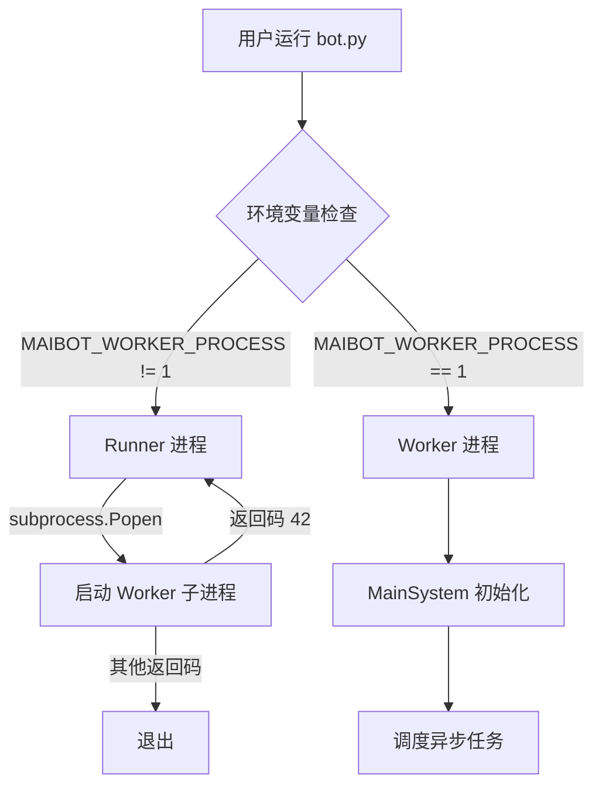
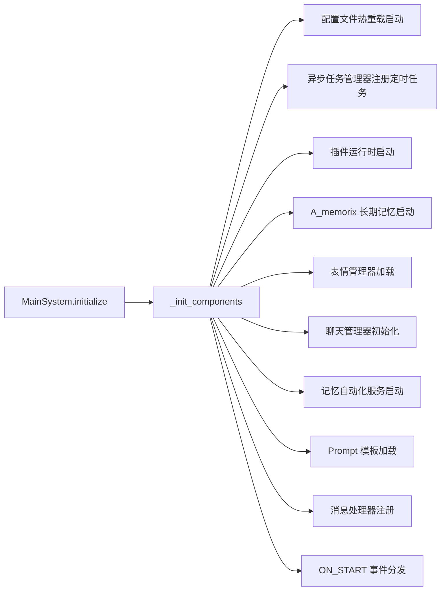
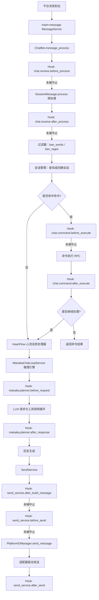
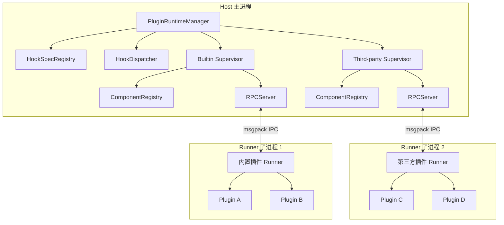
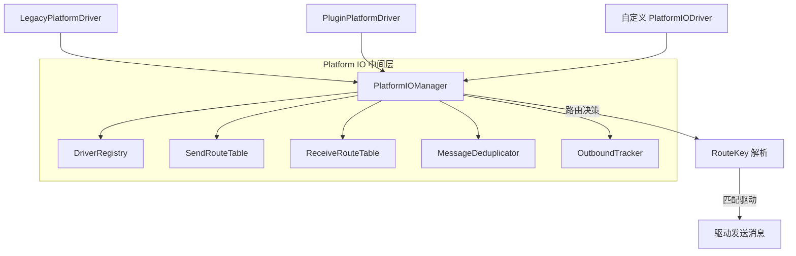

# 架构设计

本文介绍 MaiBot 的核心架构，包括进程模型、系统初始化流程、消息处理管线和关键组件。

## Runner/Worker 进程模型

MaiBot 通过 `bot.py` 实现 Runner/Worker 双进程模型：

- **Runner 进程**：守护进程，负责启动、监控 Worker 子进程。当 Worker 以退出码 42 退出时，Runner 会自动重新启动 Worker（热重启机制）。当 Runner 收到 Ctrl+C 信号时，会优雅终止 Worker。
- **Worker 进程**：实际执行业务逻辑的进程。设置环境变量 `MAIBOT_WORKER_PROCESS=1` 后进入 Worker 模式，执行 `MainSystem` 的初始化和任务调度。

## MainSystem 初始化流程

`MainSystem.initialize()` 通过 `asyncio.gather` 并行初始化各组件：

核心初始化顺序：

1. 启动配置文件热重载监视器
2. 注册定时任务（在线时间统计、统计输出、遥测心跳、表达方式自动检查）
3. 启动插件运行时（`PluginRuntimeManager.start()`），建立双子进程（内置插件 + 第三方插件）
4. 启动 A_memorix 长期记忆服务
5. 加载表情管理器
6. 初始化聊天管理器
7. 将 `ChatBot.message_process` 注册到消息 API 服务器
8. 加载 Prompt 模板
9. 触发 `ON_START` 事件并分发到插件运行时

`schedule_tasks()` 随后启动持续运行的服务：表情定期维护、消息 API 服务器、消息服务器、WebUI 服务器。

## 消息处理管线

MaiBot 的消息处理是从入站接收到出站发送的完整管线：

### 管线各阶段详解

#### 1. 消息入站

消息通过 maim-message `MessageServer` 到达，已注册的 `ChatBot.message_process` 处理函数被调用。

#### 2. Hook 拦截链

- **chat.receive.before_process**：在 `SessionMessage.process()` 之前触发，可拦截或改写原始消息。
- **chat.receive.after_process**：在消息完成预处理后触发，可改写文本、消息体或中止后续链路。

#### 3. 消息过滤

通过配置中的 `ban_words`（屏蔽词）和 `ban_regex`（屏蔽正则）过滤不当内容。

#### 4. 会话管理

`ChatManager` 查找或创建对应会话，维护会话上下文与状态。

#### 5. 命令处理

`ComponentQueryService.find_command_by_text()` 在插件组件注册表中查找匹配的命令。命令匹配后，依次触发 `chat.command.before_execute` 和 `chat.command.after_execute` Hook，然后通过 RPC 调用 Runner 子进程中的命令执行器。

#### 6. HeartFlow 心流处理

未被命令拦截的消息进入 `HeartFCMessageReceiver`，由心流消息处理器调度到 Maisaka 推理引擎。

#### 7. Maisaka 推理引擎

`ChatLoopService` 构建上下文消息窗口、候选工具列表，向 LLM 发起请求：
- **maisaka.planner.before_request**：可改写消息窗口与工具定义
- LLM 请求与工具调用循环
- **maisaka.planner.after_response**：可调整文本结果与工具调用列表

#### 8. 出站发送

`SendService` 构建出站消息，经多级 Hook 后通过 `PlatformIOManager` 路由到具体的平台驱动：
- **send_service.after_build_message**：可改写消息体或取消发送
- **send_service.before_send**：最终发送前的拦截点
- Platform IO 路由决策与驱动发送
- **send_service.after_send**：观察最终发送结果

## 插件运行时架构

- **PluginRuntimeManager**：单例管理器，管理两个 `PluginSupervisor`（内置插件 + 第三方插件）。
- **PluginSupervisor**：每个 Supervisor 管理一个 Runner 子进程，负责生命周期、RPC 通信、健康检查和插件重载。
- **Runner 子进程**：独立进程加载并运行插件代码，通过 msgpack 编解码的 IPC 与 Host 通信。
- **ComponentRegistry**：组件注册表，管理 Action、Command、Tool 三类组件的注册信息。

## Platform IO 架构

- **PlatformIOManager**：Broker 管理器，维护发送/接收路由表、驱动注册表、入站去重和出站跟踪。
- **RouteKey**：路由键，由 `platform`（平台）、`account_id`（账号）、`scope`（作用域）组成，支持从最具体到最宽泛的回退匹配。
- **PlatformIODriver**：驱动抽象基类，定义 `send_message()`、`start()`、`stop()`、`emit_inbound()` 等接口。
