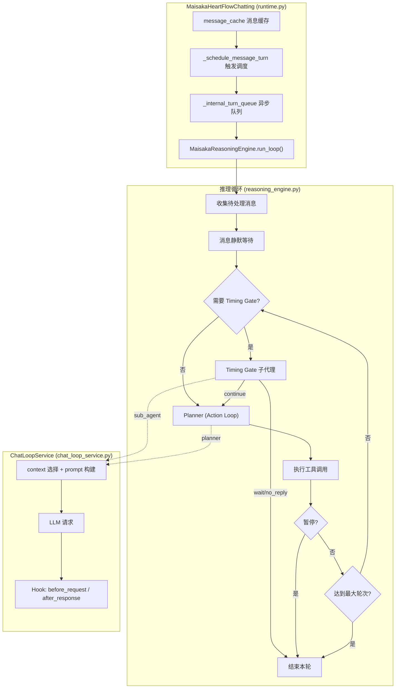
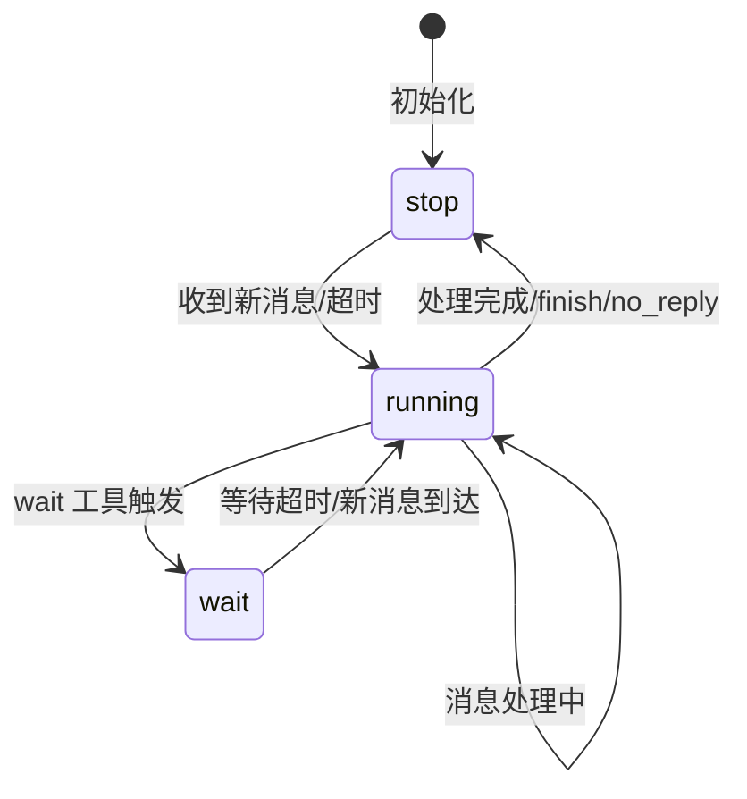
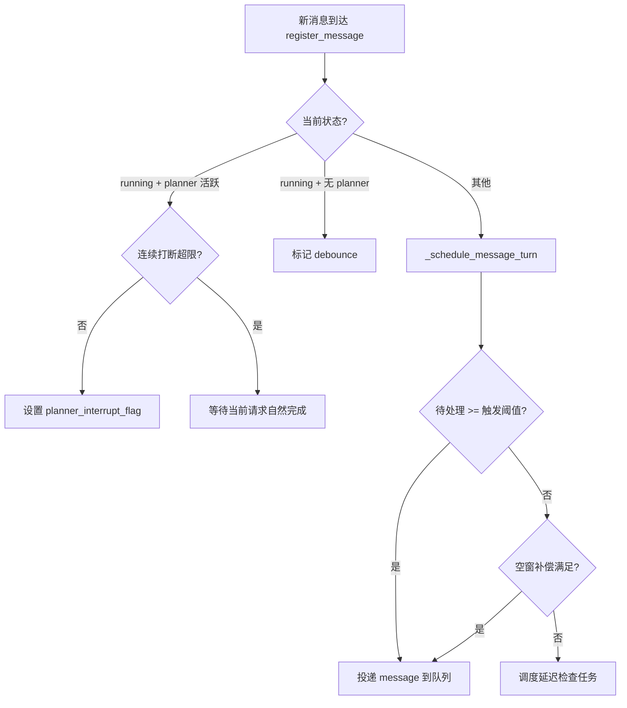
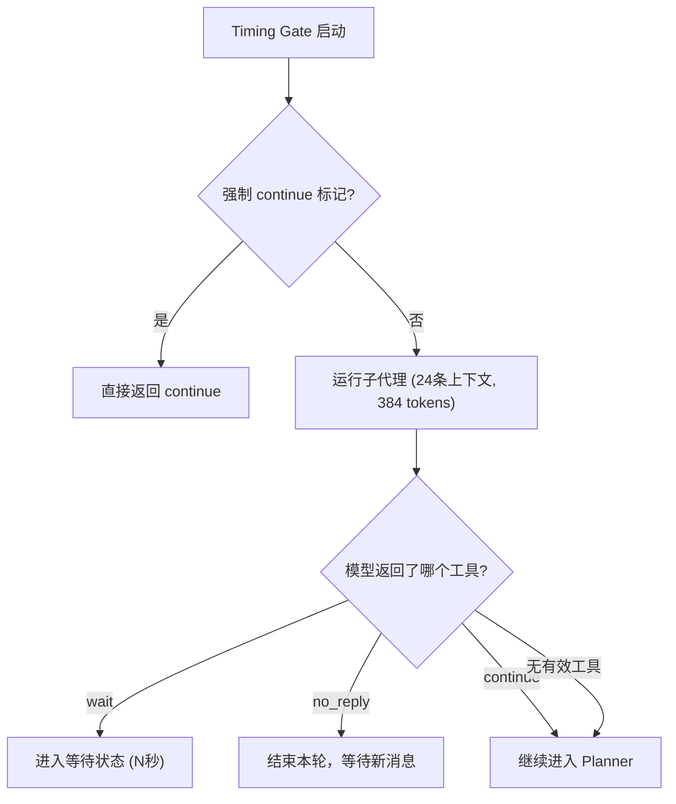
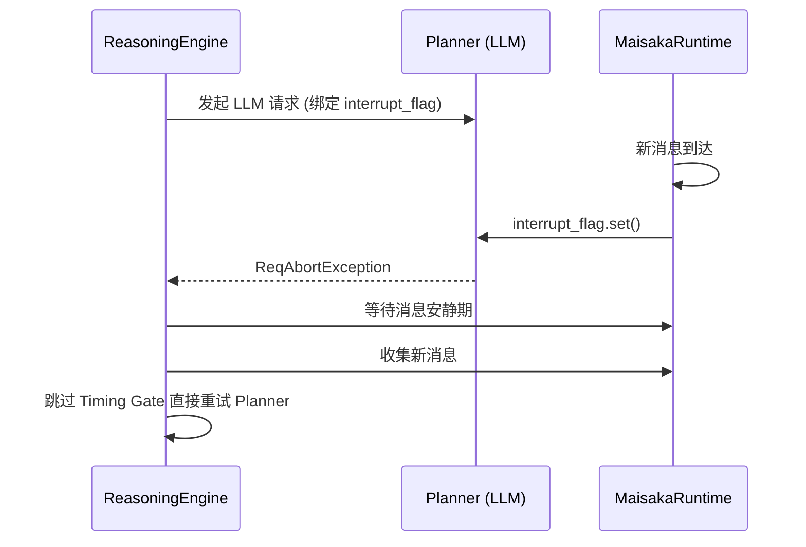
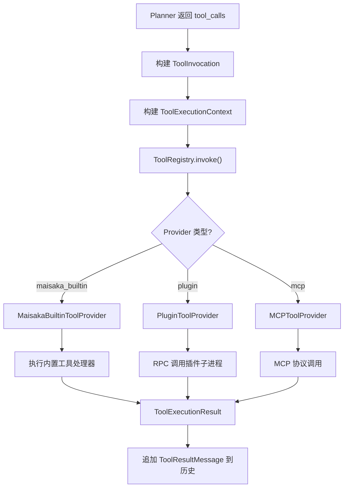
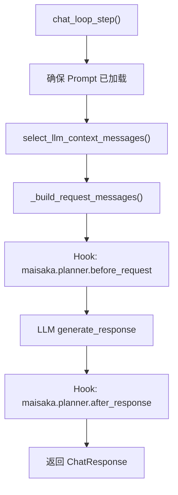
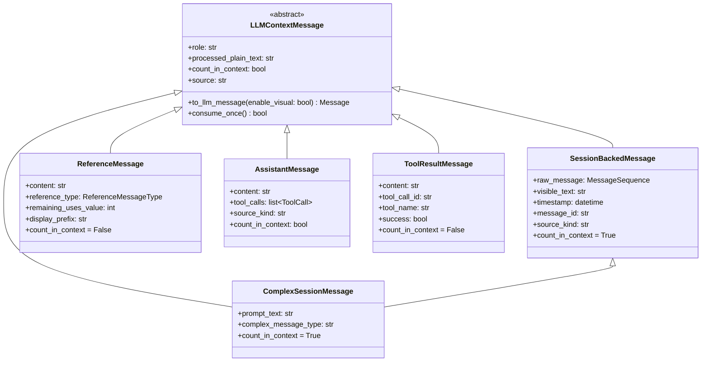
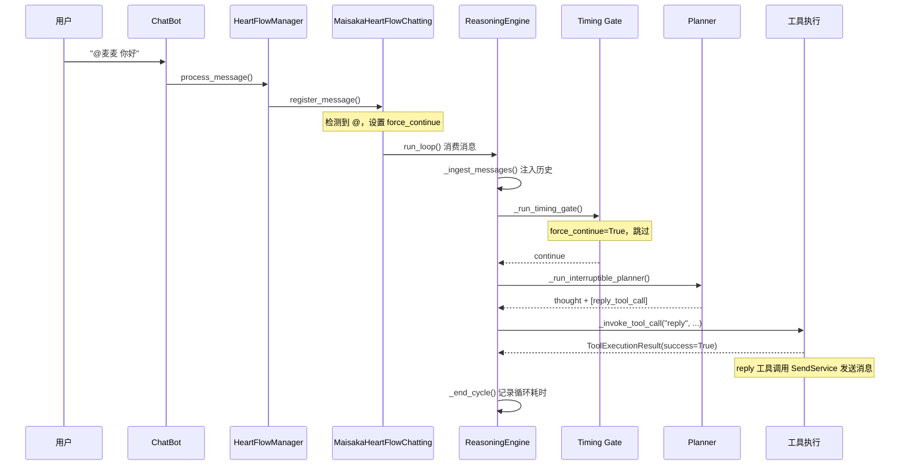

# Maisaka 推理引擎

Maisaka 是 MaiBot 的核心 AI 运行时，负责对话推理、节奏控制和工具调用。本文详述其内部架构、状态机和执行流程。

## 架构总览



## MaisakaHeartFlowChatting

源码位置：`src/maisaka/runtime.py`

每个聊天会话对应一个 `MaisakaHeartFlowChatting` 实例，由 `HeartflowManager` 管理生命周期。

### 状态机

运行时具有三种状态：



| 状态 | 说明 |
|------|------|
| `running` | 正在执行推理循环 |
| `wait` | 等待状态，wait 工具设定了超时时间 |
| `stop` | 空闲状态，等待新的外部消息触发 |

### 核心属性

| 属性 | 类型 | 说明 |
|------|------|------|
| `session_id` | `str` | 会话 ID |
| `_chat_history` | `list[LLMContextMessage]` | 内部上下文历史 |
| `message_cache` | `list[SessionMessage]` | 待处理消息缓存 |
| `_internal_turn_queue` | `asyncio.Queue` | 内部循环触发队列（"message" / "timeout"） |
| `_tool_registry` | `ToolRegistry` | 统一工具注册表 |
| `_reasoning_engine` | `MaisakaReasoningEngine` | 推理引擎 |
| `_chat_loop_service` | `MaisakaChatLoopService` | 对话循环服务 |
| `_max_internal_rounds` | `int` | 最大内部轮次（默认 6） |
| `_max_context_size` | `int` | 最大上下文消息数 |
| `_message_debounce_seconds` | `float` | 消息防抖秒数（默认 1.0） |
| `_talk_frequency_adjust` | `float` | 说话频率倍率 |
| `deferred_tool_specs_by_name` | `dict[str, ToolSpec]` | 延迟发现工具池 |
| `discovered_tool_names` | `set[str]` | 已发现的延迟工具 |

### 消息触发机制



触发阈值计算：
```python
effective_frequency = talk_value * _talk_frequency_adjust  # 回复频率
trigger_threshold = ceil(1.0 / effective_frequency)  # 所需消息数
```

空窗补偿：当新消息数不足但空窗时间较长时，按最近平均回复时长折算等价消息数。

### 强制 continue 机制

当检测到 @ 或提及时，`_arm_force_next_timing_continue()` 设置标记，使下一次 Timing Gate 直接返回 `continue`，确保 bot 回应直接呼叫。

## MaisakaReasoningEngine

源码位置：`src/maisaka/reasoning_engine.py`

核心推理引擎，负责内部思考循环和工具执行。

### 关键常量

| 常量 | 值 | 说明 |
|------|-----|------|
| `TIMING_GATE_CONTEXT_LIMIT` | 24 | Timing Gate 上下文消息上限 |
| `TIMING_GATE_MAX_TOKENS` | 384 | Timing Gate 最大输出 token |
| `TIMING_GATE_TOOL_NAMES` | `{"continue", "no_reply", "wait"}` | Timing Gate 可用工具 |
| `ACTION_HIDDEN_TOOL_NAMES` | `{"continue", "no_reply"}` | Action Loop 隐藏的工具 |
| `MAX_INTERNAL_ROUNDS` | 6 | 最大内部思考轮次 |

### run_loop 主循环

```python
async def run_loop(self) -> None:
    while runtime._running:
        # 1. 等待触发信号
        queued_trigger = await runtime._internal_turn_queue.get()
        message_triggered, timeout_triggered = _drain_ready_turn_triggers(queued_trigger)

        # 2. 消息防抖
        if message_triggered:
            await runtime._wait_for_message_quiet_period()

        # 3. 收集待处理消息
        cached_messages = runtime._collect_pending_messages()

        # 4. 消息注入历史
        await _ingest_messages(cached_messages)

        # 5. 内部思考循环
        for round_index in range(max_internal_rounds):
            # 5a. Timing Gate（如果需要）
            if timing_gate_required:
                timing_action = await _run_timing_gate(anchor_message)
                if timing_action != "continue":
                    break  # wait 或 no_reply，结束本轮

            # 5b. Planner（Action Loop）
            response = await _run_interruptible_planner()

            # 5c. 相似度检测
            if _should_replace_reasoning(response.content):
                # 替换为重新思考提示
                response.content = "我应该根据我上面思考的内容进行反思..."

            # 5d. 工具执行
            if response.tool_calls:
                should_pause, summaries, monitors = await _handle_tool_calls(...)
                if should_pause:
                    break
                continue  # 工具执行后有新信息，继续循环

            break  # 无工具调用且无内容，结束
```

### Timing Gate

Timing Gate 是一个独立的子代理，决定对话节奏：



Timing Gate 系统提示词：
- 优先从 `maisaka_timing_gate` 模板加载
- 兜底提示词强调 **只调用一个工具**，不要输出普通文本
- 可用工具仅 `wait`、`no_reply`、`continue` 三个

### Planner（Action Loop）

Planner 是主要的推理和工具执行阶段：

1. **构建工具定义**：`_build_action_tool_definitions()`
   - 过滤 `ACTION_HIDDEN_TOOL_NAMES`（continue、no_reply）
   - 内置 Action 工具直接暴露
   - 第三方/插件工具放入 deferred 池，通过 `tool_search` 发现

2. **运行可打断 Planner**：`_run_interruptible_planner()`
   - 绑定 `asyncio.Event` 中断标记
   - 新消息到达时设置标记 → LLM 请求中止（`ReqAbortException`）
   - 连续打断有上限（`planner_interrupt_max_consecutive_count`）

3. **思考去重**：`_should_replace_reasoning()`
   - 当前后思考与上一轮相似度 > 90% 时
   - 替换为"重新思考"提示，避免循环空转

### Planner 打断机制



打断后行为：
- 如果 `has_pending_messages` 且未达最大轮次 → 跳过 Timing Gate，重新进入 Planner
- 否则 → 结束当前循环

### 工具执行

工具调用通过统一 `ToolRegistry` 路由：



## 内置工具定义

源码位置：`src/maisaka/builtin_tool/`

### Timing Gate 工具

| 工具名 | 源文件 | 说明 | 关键参数 |
|--------|--------|------|---------|
| `continue` | `continue_tool.py` | 允许继续进入下一轮思考 | 无 |
| `no_reply` | `no_reply.py` | 停止当前循环，等待新外部消息 | 无 |
| `wait` | `wait.py` | 暂停对话 N 秒后重新判断 | `seconds`（默认 30） |

### Action 工具

| 工具名 | 源文件 | 说明 | 关键参数 |
|--------|--------|------|---------|
| `reply` | `reply.py` | 生成并发送回复消息 | `reply_text`、`msg_id`、`set_quote` |
| `send_emoji` | `send_emoji.py` | 发送表情包 | `emoji_description`、`msg_id` |
| `finish` | `finish.py` | 结束当前思考轮次 | 无 |
| `query_jargon` | `query_jargon.py` | 查询黑话/词条 | `words` |
| `query_memory` | `query_memory.py` | 查询长期记忆 | `query`、`mode`、`limit` |
| `query_person_info` | `query_person_info.py` | 查询人物信息 | `person_name` |
| `view_complex_message` | `view_complex_message.py` | 查看完整转发消息 | `message_id` |
| `tool_search` | `tool_search.py` | 搜索延迟发现的工具 | `query`、`limit` |

### Deferred Tool 发现机制

Action Loop 中，第三方/插件工具不直接暴露给 Planner，而是通过两步发现：

1. **tool_search**：搜索 deferred 工具池，匹配到的工具名标记为"已发现"
2. **下一轮 Planner**：已发现的工具加入可见工具列表

这减少了 Planner 一次看到的工具数量，避免选择困难。

## MaisakaChatLoopService

源码位置：`src/maisaka/chat_loop_service.py`

负责单步 LLM 请求的封装，包括上下文选择、Prompt 构建和 Hook 触发。

### chat_loop_step 流程



### 上下文选择策略

`select_llm_context_messages()` 从历史中选择给 LLM 的上下文：

1. 按 `request_kind` 过滤（`planner` 请求隐藏 Timing Gate 工具链）
2. 从末尾向前遍历，选择能成功转换为 LLM 消息的条目
3. 计数仅计算 `count_in_context=True` 的消息（`ToolResultMessage` 和 `ReferenceMessage` 不占窗口）
4. 达到 `max_context_size` 后停止
5. 隐藏最早 50% 的 assistant 文本消息（保留工具调用链路）

### Hook Specs

| Hook | 可中止 | 可改写 | 说明 |
|------|--------|--------|------|
| `maisaka.planner.before_request` | ✗ | ✓ | 可改写消息列表和工具定义 |
| `maisaka.planner.after_response` | ✗ | ✓ | 可调整文本结果和工具调用列表 |

## 上下文消息类型

源码位置：`src/maisaka/context_messages.py`



### ReferenceMessageType

| 值 | 说明 |
|----|------|
| `custom` | 自定义参考消息 |
| `jargon` | 黑话/词条查询结果 |
| `memory` | 长期记忆检索结果 |
| `tool_hint` | 工具提示信息（如 deferred tools 提醒） |

### 上下文窗口占用

| 消息类型 | 占用窗口 | 说明 |
|----------|---------|------|
| `SessionBackedMessage` | ✓ | 真实用户消息 |
| `ComplexSessionMessage` | ✓ | 复杂/转发消息 |
| `ReferenceMessage` | ✗ | 参考信息（不占用窗口） |
| `AssistantMessage` (assistant) | ✓ | 内部思考文本 |
| `AssistantMessage` (perception) | ✗ | 感知类文本（打断提示等） |
| `ToolResultMessage` | ✗ | 工具执行结果 |

## Planner 消息前缀

源码位置：`src/maisaka/planner_message_utils.py`

每条用户消息注入 Planner 时，会添加结构化前缀：

```
[时间]HH:MM:SS
[用户名]nickname
[用户群昵称]group_card
[msg_id]message_id
[发言内容]实际消息文本
```

`build_planner_prefix()` 构建前缀，`build_planner_user_prefix_from_session_message()` 从 `SessionMessage` 提取参数。

## 监控事件

源码位置：`src/maisaka/monitor_events.py`

通过 WebSocket 向前端监控面板广播事件：

| 事件 | 触发时机 | 关键数据 |
|------|---------|---------|
| `session.start` | 运行时启动 | session_id, session_name |
| `message.ingested` | 消息注入历史 | speaker_name, content, message_id |
| `cycle.start` | 思考循环开始 | cycle_id, round_index, max_rounds |
| `timing_gate.result` | Timing Gate 决策完成 | action, content, tool_calls, prompt_tokens |
| `planner.finalized` | 规划器完成 | 完整 cycle 数据、token 统计、耗时 |

## 完整推理流程示例

以群聊中用户发送一条 @bot 消息为例：


