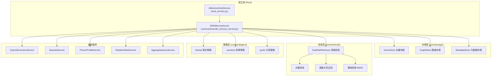
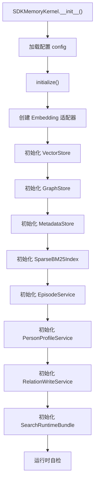
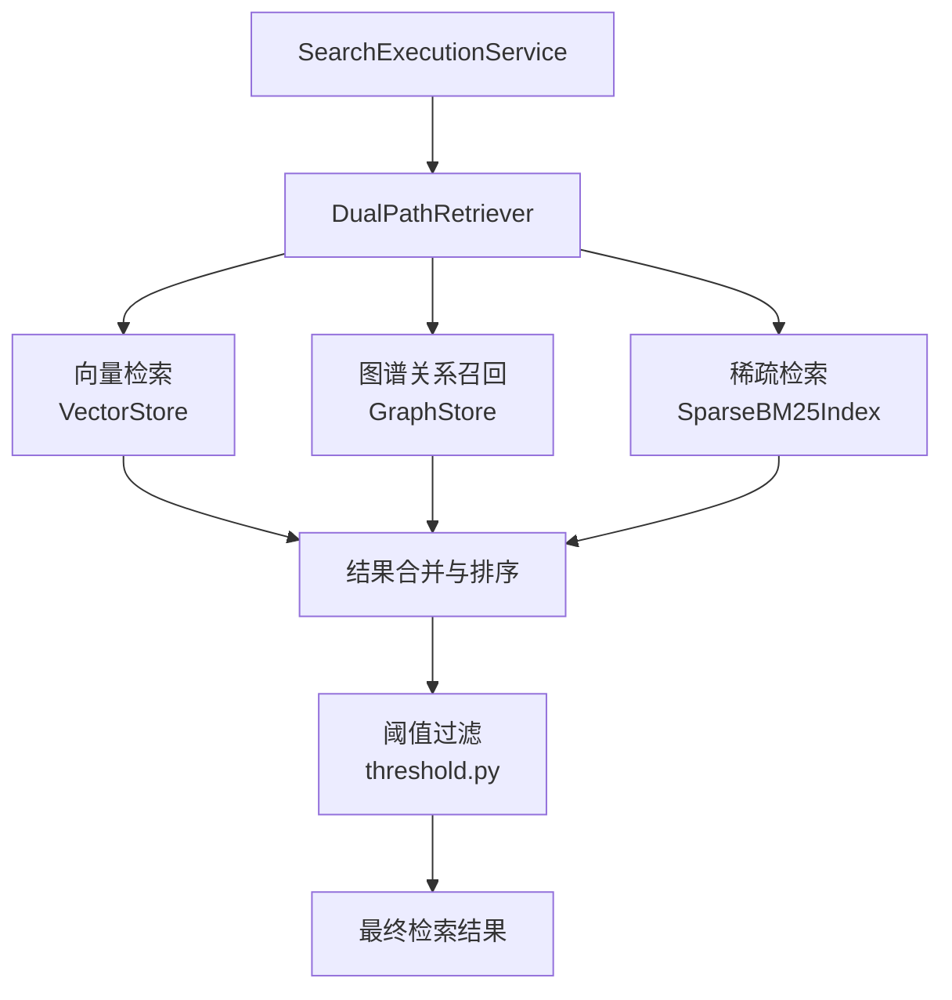

# 记忆系统（A-Memorix）

A-Memorix 是 MaiBot 内置的长期记忆子系统，负责持久化用户偏好、对话记忆和人物画像等数据。本文详述其架构、存储机制和检索流程。

## 架构总览



## SDKMemoryKernel

源码位置：`src/A_memorix/core/runtime/sdk_memory_kernel.py`

`SDKMemoryKernel` 是 A-Memorix 的核心运行时，初始化时加载配置并构建所有存储和检索组件。

### 初始化流程



### KernelSearchRequest

检索请求的数据结构：

| 字段 | 类型 | 默认值 | 说明 |
|------|------|--------|------|
| `query` | `str` | `""` | 查询文本 |
| `limit` | `int` | `5` | 返回条数 |
| `mode` | `str` | `"search"` | 检索模式 |
| `chat_id` | `str` | `""` | 聊天流 ID |
| `person_id` | `str` | `""` | 人物 ID |
| `time_start` | `Optional[str\|float]` | `None` | 起始时间 |
| `time_end` | `Optional[str\|float]` | `None` | 结束时间 |
| `respect_filter` | `bool` | `True` | 是否应用聊天过滤配置 |
| `user_id` | `str` | `""` | 用户 ID |
| `group_id` | `str` | `""` | 群组 ID |

### 检索模式

| 模式 | 说明 | 必需参数 |
|------|------|---------|
| `search` | 语义向量检索 | `query` |
| `time` | 时间范围检索 | `time_start` 或 `time_end` |
| `hybrid` | 向量 + 时间混合 | `time_start` 或 `time_end` |
| `episode` | Episode 检索 | `query` |
| `aggregate` | 聚合检索 | `query` |

::: warning
`semantic` 模式已移除，传入将返回参数错误。`time` 和 `hybrid` 模式**必须**提供 `time_start` 或 `time_end`，否则返回错误。
:::

## AMemorixHostService

源码位置：`src/A_memorix/host_service.py`

宿主侧服务，桥接 MaiBot 主进程与 A-Memorix 内核：

```python
class AMemorixHostService:
    _kernel: Optional[SDKMemoryKernel]
    _config_cache: Dict[str, Any] | None

    async def start() -> None
    async def stop() -> None
    async def reload() -> None  # 关闭内核 → 重新读取配置 → 重建内核
    async def invoke(component_name, args) -> Any  # 统一调用入口
```

### invoke 调用入口

`invoke()` 根据组件名路由到内核的对应方法：

| 组件名 | 对应内核方法 |
|--------|-------------|
| `search_memory` | `kernel.search_memory()` |
| `ingest_summary` | `kernel.ingest_summary()` |
| `ingest_text` | `kernel.ingest_text()` |
| `get_person_profile` | `kernel.get_person_profile()` |
| `maintain_memory` | `kernel.maintain_memory()` |
| `memory_stats` | `kernel.memory_stats()` |
| `memory_graph_admin` | `kernel.memory_graph_admin()` |
| `memory_source_admin` | `kernel.memory_source_admin()` |
| `memory_episode_admin` | `kernel.memory_episode_admin()` |
| `memory_profile_admin` | `kernel.memory_profile_admin()` |
| `memory_runtime_admin` | `kernel.memory_runtime_admin()` |
| `memory_import_admin` | `kernel.memory_import_admin()` |
| `memory_tuning_admin` | `kernel.memory_tuning_admin()` |
| `memory_v5_admin` | `kernel.memory_v5_admin()` |
| `memory_delete_admin` | `kernel.memory_delete_admin()` |

### 配置管理

- 配置文件路径：`config/a_memorix.toml`
- Schema 文件：`src/A_memorix/config_schema.json`
- `get_config()` / `update_config()` / `get_raw_config()` / `update_raw_config()` 读写配置
- 更新配置后自动 `reload()`，重建内核实例

## 存储层

源码位置：`src/A_memorix/core/storage/`

### VectorStore

源码：`vector_store.py`

向量存储，保存段落的 embedding 向量，支持：

- 写入向量（段落哈希 → 向量映射）
- 最近邻搜索（余弦相似度）
- 量化支持（`QuantizationType`：`int8`）
- 非阻塞写入队列（embedding 失败时入队回填）

### GraphStore

源码：`graph_store.py`

知识图谱存储，管理实体和关系：

- 创建/删除/重命名节点
- 创建/删除/更新边（含权重）
- 关系向量索引
- 图谱访问操作（reinforce / protect / restore / freeze）

### MetadataStore

源码：`metadata_store.py`

元数据存储，管理来源、段落和运维记录：

- 来源（Source）管理：列表、删除、批量删除
- 段落元数据追踪
- 关系维护操作（reinforce / protect / restore / freeze / recycle_bin）
- V5 运维记录（`external_memory_refs`、`memory_v5_operations`、`delete_operations`）

### knowledge_types.py

定义知识内容的数据类型，区分事实性知识和叙事性知识。

## 检索层

源码位置：`src/A_memorix/core/retrieval/`

### 双路检索架构



### 关键组件

| 文件 | 组件 | 说明 |
|------|------|------|
| `dual_path.py` | `DualPathRetriever` | 协调向量 + 图谱联合召回 |
| `graph_relation_recall.py` | 图谱关系召回 | 基于图的关联查找 |
| `sparse_bm25.py` | `SparseBM25Index` | 基于 BM25 的稀疏检索（需 FTS5 支持） |
| `pagerank.py` | PageRank | 图结构权重计算 |
| `threshold.py` | 阈值过滤 | 相似度阈值控制 |

### RetrivalResult

检索结果的数据结构，包含匹配的段落、相似度分数和来源信息。

## 策略层

源码位置：`src/A_memorix/core/strategies/`

写入策略决定记忆如何被处理和存储：

| 策略 | 源文件 | 说明 |
|------|--------|------|
| `factual` | `factual.py` | 事实性知识策略，提取实体和关系 |
| `narrative` | `narrative.py` | 叙事性策略，处理对话摘要 |
| `quote` | `quote.py` | 引用策略，保留原文 |

所有策略继承自 `base.py` 中的基类，定义统一的处理接口。

## 辅助服务

### EpisodeService

源码：`core/utils/episode_service.py`

管理 Episode（对话片段），按 source 重建：

- 状态查询（pending / processing / completed）
- 批量处理 pending Episode
- Episode 分段服务（`EpisodeSegmentationService`）
- Episode 检索服务（`EpisodeRetrievalService`）

### PersonProfileService

源码：`core/utils/person_profile_service.py`

人物画像管理：

- 自动快照：从记忆数据中自动提取人物特征
- 手动 override：通过 API 手动设置画像属性
- 画像查询：按 person_id 和 chat_id 获取画像

### RelationWriteService

源码：`core/utils/relation_write_service.py`

关系写入服务：

- 实体和关系的联合写入
- `external_id` 幂等去重
- 段落/关系联合写入

### AggregateQueryService

源码：`core/utils/aggregate_query_service.py`

聚合查询服务，组合多种检索模式的结果。

### ImportTaskManager

源码：`core/utils/web_import_manager.py`

Web 导入任务管理器：

- 任务创建（上传、粘贴、原始扫描、LPMM 等模式）
- 任务状态追踪
- 分块处理
- 失败重试

## 基础工具接口

### search_memory

检索长期记忆。

**参数**：

| 参数 | 类型 | 必填 | 说明 |
|------|------|------|------|
| `query` | `str` | 否 | 查询文本 |
| `mode` | `str` | 否 | 检索模式（search/time/hybrid/episode/aggregate） |
| `limit` | `int` | 否 | 返回条数（默认 5） |
| `chat_id` | `str` | 否 | 聊天流 ID |
| `person_id` | `str` | 否 | 人物 ID |
| `time_start` | `float` | 否 | 起始时间戳 |
| `time_end` | `float` | 否 | 结束时间戳 |
| `respect_filter` | `bool` | 否 | 是否应用聊天过滤配置 |

### ingest_summary

写入聊天摘要到长期记忆。

**参数**：

| 参数 | 类型 | 必填 | 说明 |
|------|------|------|------|
| `external_id` | `str` | 是 | 外部幂等 ID |
| `chat_id` | `str` | 是 | 聊天流 ID |
| `text` | `str` | 是 | 摘要文本 |
| `participants` | `list[str]` | 否 | 参与者列表 |
| `time_start` | `float` | 否 | 起始时间戳 |
| `time_end` | `float` | 否 | 结束时间戳 |
| `tags` | `list[str]` | 否 | 标签 |
| `metadata` | `dict` | 否 | 元数据 |

### ingest_text

写入普通文本记忆。

| 参数 | 类型 | 必填 | 说明 |
|------|------|------|------|
| `external_id` | `str` | 是 | 外部幂等 ID |
| `source_type` | `str` | 是 | 来源类型 |
| `text` | `str` | 是 | 原始文本 |
| `chat_id` | `str` | 否 | 聊天流 ID |
| `entities` | `list` | 否 | 实体列表 |
| `relations` | `list` | 否 | 关系列表 |

### get_person_profile

获取人物画像。

| 参数 | 类型 | 必填 | 说明 |
|------|------|------|------|
| `person_id` | `str` | 是 | 人物 ID |
| `chat_id` | `str` | 否 | 聊天流 ID |
| `limit` | `int` | 否 | 证据条数 |

### maintain_memory

维护长期记忆关系状态。

| action | 说明 |
|--------|------|
| `reinforce` | 强化关系 |
| `protect` | 保护关系（指定小时数内不衰减） |
| `restore` | 恢复关系 |
| `freeze` | 冻结关系 |
| `recycle_bin` | 查看回收站 |

## 管理工具接口

| 工具 | 常用 action |
|------|------------|
| `memory_graph_admin` | `get_graph` / `create_node` / `delete_node` / `rename_node` / `create_edge` / `delete_edge` / `update_edge_weight` |
| `memory_source_admin` | `list` / `delete` / `batch_delete` |
| `memory_episode_admin` | `query` / `list` / `get` / `status` / `rebuild` / `process_pending` |
| `memory_profile_admin` | `query` / `list` / `set_override` / `delete_override` |
| `memory_runtime_admin` | `save` / `get_config` / `self_check` / `refresh_self_check` / `set_auto_save` |
| `memory_import_admin` | `settings` / `get_guide` / `create_upload` / `create_paste` / `list` / `get` / `chunks` / `cancel` / `retry_failed` |
| `memory_tuning_admin` | `settings` / `get_profile` / `apply_profile` / `rollback_profile` / `create_task` / `list_tasks` / `get_task` / `cancel` / `apply_best` / `get_report` |
| `memory_v5_admin` | `status` / `recycle_bin` / `restore` / `reinforce` / `weaken` / `remember_forever` / `forget` |
| `memory_delete_admin` | `preview` / `execute` / `restore` / `get_operation` / `list_operations` / `purge` |

## 与 MaiBot 的集成

### 插件模式（Legacy）

源码位置：`src/A_memorix/plugin.py`

`AMemorixPlugin` 继承 `MaiBotPlugin`，通过 `@Tool` 装饰器注册内存检索和写入工具到插件运行时。

::: info
当前 MaiBot 主线通过 `AMemorixHostService` 直接接入，不再通过插件运行时发现和加载。`plugin.py` 保留为兼容入口。
:::

### 配置

- 默认配置文件：`config/a_memorix.toml`
- 运行时数据目录：`data/a-memorix`（由 `storage.data_dir` 控制）
- 配置 Schema：`config_schema.json` 供 WebUI 长期记忆控制台使用
- WebUI 接口：`/api/webui/memory/*`

## 元数据版本

当前元数据 schema 版本为 **v9**，支持：

- 外部引用（`external_memory_refs`）
- 运维操作记录（`memory_v5_operations`）
- 删除操作记录（`delete_operations`）

## 删除语义（source 模式）

| 字段 | 说明 |
|------|------|
| `requested_source_count` | 请求删除的 source 数 |
| `matched_source_count` | 实际命中的 source 数 |
| `deleted_paragraph_count` | 实际删除段落数 |
| `deleted_count` | 与实际删除对象一致 |
| `success` | 基于实际命中与实际删除判定 |
