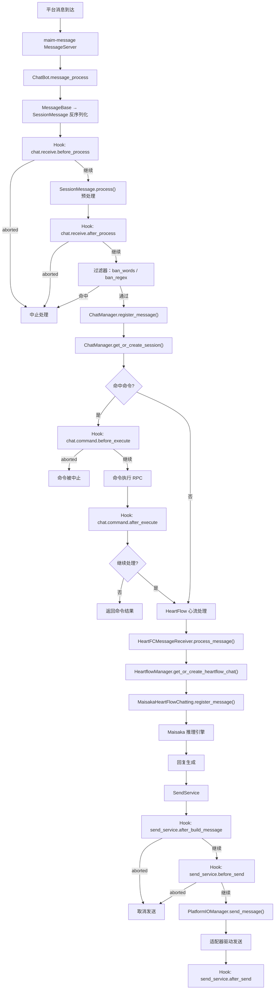

# 消息管线

MaiBot 的消息处理管线是从入站接收到出站发送的完整链路。本文详述管线各阶段的内部机制、数据结构和 Hook 拦截点。

## 整体流程



## 消息入站与反序列化

### 入口：`ChatBot.message_process()`

源码位置：`src/chat/message_receive/bot.py`

消息通过 maim-message `MessageServer` 到达后，调用 `ChatBot.message_process(message_data)` 进入主链路：

```python
async def message_process(self, message_data: Dict[str, Any]) -> None:
    # 1. 确保后台任务已启动
    await self._ensure_started()
    # 2. 规范化 group_id / user_id 为字符串
    # 3. 反序列化
    maim_raw_message = MessageBase.from_dict(message_data)
    message = SessionMessage.from_maim_message(maim_raw_message)
    await self.receive_message(message)
```

### `SessionMessage` 结构

源码位置：`src/chat/message_receive/message.py`

`SessionMessage` 继承自 `MaiMessage`，是管线中流转的核心消息对象：

| 属性 | 类型 | 说明 |
|------|------|------|
| `message_id` | `str` | 消息唯一 ID |
| `platform` | `str` | 来源平台标识 |
| `session_id` | `str` | 会话 ID（由 `SessionUtils.calculate_session_id()` 计算） |
| `processed_plain_text` | `str` | 经过预处理的纯文本 |
| `message_info` | `MessageInfo` | 包含 `user_info`、`group_info`、`additional_config` |
| `raw_message` | `MessageSequence` | 原始消息组件序列 |
| `is_at` | `bool` | 是否 @ 了 bot |
| `is_mentioned` | `bool` | 是否提及了 bot |
| `is_command` | `bool` | 是否命中命令 |
| `is_notify` | `bool` | 是否为通知消息 |
| `timestamp` | `datetime` | 消息时间戳 |

### `SessionMessage.process()` 预处理

将原始消息组件转化为纯文本，支持以下组件类型：

| 组件 | 处理方式 |
|------|----------|
| `TextComponent` | 直接返回文本 |
| `ImageComponent` | 调用 `image_manager.get_image_description()` 生成 `[图片：描述]` |
| `EmojiComponent` | 调用 `emoji_manager.get_emoji_description()` 生成 `[表情包：描述]` |
| `AtComponent` | 解析目标用户名，生成 `@昵称` |
| `VoiceComponent` | 调用 `get_voice_text()` 转写为 `[语音：转录文本]` |
| `ReplyComponent` | 查找原消息内容，生成 `[回复了XXX的消息：内容]` |
| `ForwardNodeComponent` | 递归处理转发节点，生成 `【合并转发消息：...】` |

入站主链调用时使用轻量模式（`enable_heavy_media_analysis=False, enable_voice_transcription=False`），图片/表情包的二进制数据延迟到 Maisaka 需要时按需回填。

## Hook 拦截链

### chat.receive.before_process

在 `SessionMessage.process()` 之前触发，可拦截或改写原始消息。

| 属性 | 值 |
|------|-----|
| 注册位置 | `src/chat/message_receive/bot.py` `register_chat_hook_specs()` |
| 默认超时 | 8000ms |
| 允许中止 | 是 |
| 允许改写 | 是 |

参数 Schema：
```json
{
  "message": { "type": "object", "description": "当前入站消息的序列化 SessionMessage" }
}
```

### chat.receive.after_process

在消息完成预处理后触发，可改写文本、消息体或中止后续链路。

| 属性 | 值 |
|------|-----|
| 默认超时 | 8000ms |
| 允许中止 | 是 |
| 允许改写 | 是 |

### chat.command.before_execute

在命令匹配成功、实际执行前触发。

| 属性 | 值 |
|------|-----|
| 默认超时 | 5000ms |
| 允许中止 | 是 |
| 允许改写 | 是 |

参数包含：`message`、`command_name`、`plugin_id`、`matched_groups`

### chat.command.after_execute

在命令执行结束后触发，可调整返回文本和是否继续主链处理。

| 属性 | 值 |
|------|-----|
| 默认超时 | 5000ms |
| 允许中止 | 否 |
| 允许改写 | 是 |

参数包含：`message`、`command_name`、`plugin_id`、`matched_groups`、`success`、`response`、`intercept_message_level`、`continue_process`

### send_service.after_build_message

在出站 `SessionMessage` 构建完成后触发，可改写消息体或取消发送。

| 属性 | 值 |
|------|-----|
| 注册位置 | `src/services/send_service.py` `register_send_service_hook_specs()` |
| 默认超时 | 5000ms |
| 允许中止 | 是 |

### send_service.before_send

在真正调用 Platform IO 发送前触发，最终拦截点。

| 属性 | 值 |
|------|-----|
| 默认超时 | 5000ms |
| 允许中止 | 是 |

### send_service.after_send

在发送流程结束后触发，仅观察用途。不允许中止或改写。

## 消息过滤

源码位置：`src/chat/message_receive/bot.py` `receive_message()` 中

过滤在 `chat.receive.after_process` Hook 之后执行：

1. **屏蔽词过滤**（`MessageUtils.check_ban_words()`）：检查 `processed_plain_text` 是否包含配置中的 `ban_words`
2. **正则过滤**（`MessageUtils.check_ban_regex()`）：检查是否匹配配置中的 `ban_regex` 模式

命中过滤规则后，消息直接丢弃，不会进入后续任何阶段。

## 会话管理

源码位置：`src/chat/message_receive/chat_manager.py`

### ChatManager

单例 `chat_manager`，管理所有聊天会话。

```python
class ChatManager:
    sessions: Dict[str, BotChatSession]    # session_id → BotChatSession
    last_messages: Dict[str, SessionMessage]  # session_id → 最近一条消息
```

### Session ID 计算

由 `SessionUtils.calculate_session_id()` 根据以下参数生成：

- `platform`：平台标识
- `user_id`：用户 ID
- `group_id`：群 ID（可选）
- `account_id`：平台账号 ID（可选，从 `additional_config` 提取）
- `scope`：路由作用域（可选，从 `additional_config` 提取）

### BotChatSession

继承自 `MaiChatSession`，扩展了：

| 属性 | 类型 | 说明 |
|------|------|------|
| `context` | `SessionContext` | 会话上下文（含最近消息、模板名） |
| `accept_format` | `List[str]` | 可接受的消息格式列表 |

| 方法 | 说明 |
|------|------|
| `update_active_time()` | 更新最后活跃时间 |
| `set_context(message)` | 设置会话上下文 |
| `check_types(types)` | 检查消息是否符合可接受类型 |

## 命令处理

源码位置：`src/chat/message_receive/bot.py` `_process_commands()`

命令处理流程：

1. `component_query_service.find_command_by_text(text)` 在插件组件注册表中查找匹配命令
2. 命中后触发 `chat.command.before_execute` Hook
3. 调用命令执行器 `command_executor()`，传入 `message`、`plugin_config`、`matched_groups`
4. 触发 `chat.command.after_execute` Hook
5. 根据 `intercept_message_level` 决定是否继续后续处理
   - `intercept_message_level == 0`：继续处理（消息会同时走 HeartFlow）
   - `intercept_message_level > 0`：停止处理

被命令拦截的消息会写入数据库（`MessageUtils.store_message_to_db()`），但不再进入 HeartFlow。

## HeartFlow 心流处理

源码位置：`src/chat/heart_flow/`

### HeartFCMessageReceiver

源码位置：`src/chat/heart_flow/heartflow_message_processor.py`

```python
class HeartFCMessageReceiver:
    async def process_message(self, message: SessionMessage):
        # 1. 跳过通知消息
        # 2. 存储消息到数据库
        # 3. 获取或创建 HeartFlow Chat
        # 4. 注册消息到 Maisaka 运行时
        # 5. 注册用户到 Person 信息库
```

### HeartflowManager

源码位置：`src/chat/heart_flow/heartflow_manager.py`

管理 session 级别的 `MaisakaHeartFlowChatting` 实例：

```python
class HeartflowManager:
    heartflow_chat_list: Dict[str, MaisakaHeartFlowChatting]
    _chat_create_locks: Dict[str, asyncio.Lock]

    async def get_or_create_heartflow_chat(self, session_id: str) -> MaisakaHeartFlowChatting
    def adjust_talk_frequency(self, session_id: str, frequency: float) -> None
```

使用双重检查锁（double-checked locking）确保同一会话只创建一个 Maisaka 运行时实例。

## 出站发送

源码位置：`src/services/send_service.py`

`SendService` 构建出站消息的流程：

1. 构建 `MessageSending` 对象（`SessionMessage` + 目标信息）
2. 触发 `send_service.after_build_message` Hook
3. 计算打字时间（`calculate_typing_time()`）
4. 触发 `send_service.before_send` Hook
5. 通过 `PlatformIOManager.send_message()` 路由到平台驱动
6. 触发 `send_service.after_send` Hook
7. 发送成功的消息写入数据库并同步到 Maisaka 历史记录

## 内置 Hook 汇总

所有内置 Hook 由 `hook_catalog.py` 统一注册：

| Hook 名称 | 注册模块 | 触发时机 | 可中止 |
|-----------|---------|---------|--------|
| `chat.receive.before_process` | `chat/message_receive/bot.py` | 消息预处理前 | ✓ |
| `chat.receive.after_process` | `chat/message_receive/bot.py` | 消息预处理后 | ✓ |
| `chat.command.before_execute` | `chat/message_receive/bot.py` | 命令执行前 | ✓ |
| `chat.command.after_execute` | `chat/message_receive/bot.py` | 命令执行后 | ✗ |
| `maisaka.planner.before_request` | `maisaka/chat_loop_service.py` | LLM 请求前 | ✗ |
| `maisaka.planner.after_response` | `maisaka/chat_loop_service.py` | LLM 响应后 | ✗ |
| `send_service.after_build_message` | `services/send_service.py` | 出站消息构建后 | ✓ |
| `send_service.before_send` | `services/send_service.py` | 发送前 | ✓ |
| `send_service.after_send` | `services/send_service.py` | 发送后 | ✗ |

## 数据流图

```mermaid
graph LR
    subgraph 入站
        A[平台适配器] -->|MessageBase| B[SessionMessage]
    end
    subgraph 预处理
        B --> C[Hook: before_process]
        C --> D[process 预处理]
        D --> E[Hook: after_process]
        E --> F[过滤检查]
    end
    subgraph 分发
        F --> G[命令匹配]
        G -->|命中| H[命令执行]
        G -->|未命中| I[HeartFlow]
        H -->|继续| I
    end
    subgraph 推理
        I --> J[Maisaka 运行时]
        J --> K[Timing Gate]
        K --> L[Planner]
        L --> M[工具执行]
    end
    subgraph 出站
        M --> N[SendService]
        N --> O[Platform IO]
        O --> P[适配器驱动发送]
    end
```


