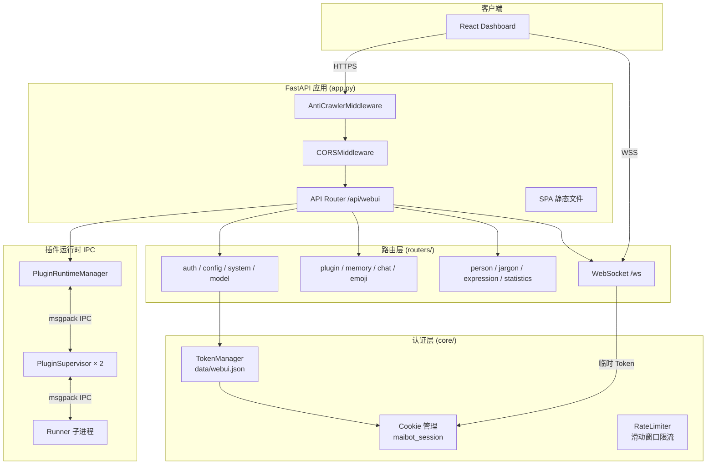
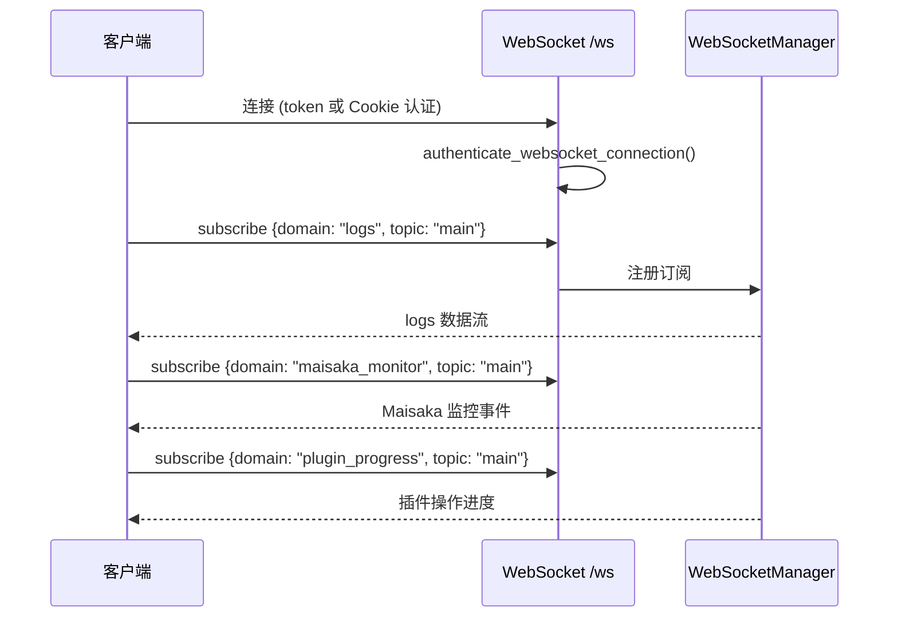
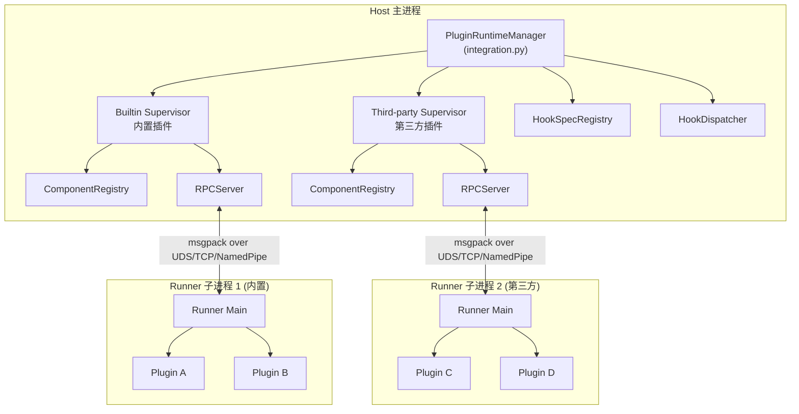
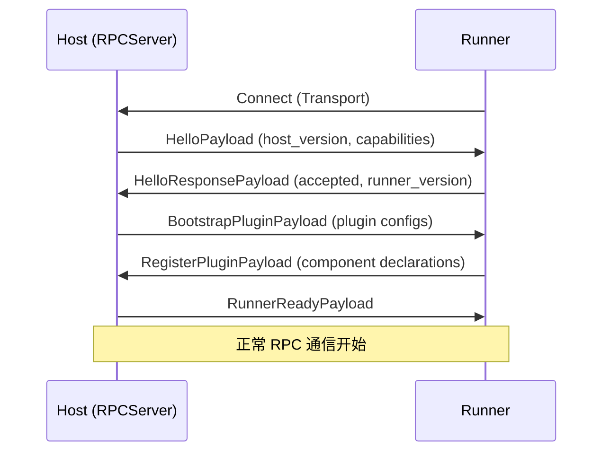
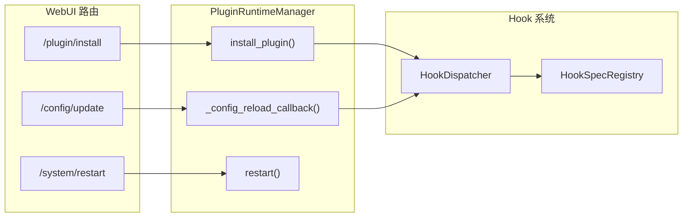

# WebUI 内部机制

MaiBot WebUI 是基于 FastAPI 的 Web 管理后端，提供插件管理、配置编辑、认证鉴权、WebSocket 通信等功能。本文详述其架构、安全机制和通信协议。

## 整体架构



## FastAPI 应用工厂

源码位置：`src/webui/app.py`

`create_app()` 创建 FastAPI 实例并配置中间件和路由：

```python
def create_app(host="0.0.0.0", port=8001, enable_static=True) -> FastAPI:
    app = FastAPI(title="MaiBot WebUI")
    _setup_anti_crawler(app)   # 反爬虫中间件
    _setup_cors(app, port)     # CORS 跨域配置
    _register_api_routes(app)  # 注册 API 路由
    _setup_robots_txt(app)     # robots.txt
    if enable_static:
        _setup_static_files(app)  # SPA 静态文件 + 路径穿越防护
    return app
```

### CORS 配置

只允许 localhost 来源（开发端口 + 服务端口）：

```python
allow_origins = [
    "http://localhost:5173",      # Vite 开发服务器
    "http://127.0.0.1:5173",
    f"http://localhost:{port}",   # WebUI 服务端口
    f"http://127.0.0.1:{port}",
]
allow_credentials = True
```

### 静态文件安全

`_resolve_safe_static_file_path()` 通过 `resolve()` + `relative_to()` 双重检查防止路径穿越。

## 认证与安全

### Token 管理器

源码位置：`src/webui/core/security.py`

`TokenManager` 管理 WebUI 的访问令牌：

| 方法 | 说明 |
|------|------|
| `_create_new_token()` | 生成 64 位十六进制 Token（`secrets.token_hex(32)`） |
| `get_token()` | 获取当前有效 Token |
| `verify_token(token)` | 验证 Token（`secrets.compare_digest` 防时序攻击） |
| `update_token(new_token)` | 更新 Token（需 ≥10 位，含大小写和特殊符号） |
| `regenerate_token()` | 重新生成随机 Token |
| `is_first_setup()` | 检查是否首次配置 |
| `mark_setup_completed()` | 标记配置完成 |

Token 存储在 `data/webui.json`（明文 JSON），依赖文件系统权限保护。

### Cookie 认证

源码位置：`src/webui/core/auth.py`

| 配置 | 值 |
|------|-----|
| Cookie 名称 | `maibot_session` |
| 有效期 | 7 天 |
| HttpOnly | ✓（阻止 JS 读取） |
| SameSite | `lax` |
| Secure | 根据环境自动判断 |

认证流程：

```mermaid
sequenceDiagram
    participant C as 客户端
    participant S as 服务端
    participant T as TokenManager

    C->>S: POST /auth/verify {token}
    S->>T: verify_token(token)
    T-->>S: valid
    S->>C: Set-Cookie: maibot_session=token; HttpOnly; SameSite=lax
    C->>S: GET /api/webui/... (Cookie: maibot_session=token)
    S->>T: verify_token(cookie_value)
    T-->>S: valid
    S-->>C: 200 OK
```

Secure 标志判断逻辑：
1. 读取配置 `webui.secure_cookie`
2. 检查 `webui.mode == "production"`
3. 检查请求头 `X-Forwarded-Proto` 或 `request.url.scheme`
4. HTTP 连接强制禁用 Secure（即使配置要求）

### 限流器

源码位置：`src/webui/core/rate_limiter.py`

内存型滑动窗口限流器：

| 场景 | 限制 | 封禁 |
|------|------|------|
| 认证接口 | 10 次/分钟/IP | 连续失败 5 次 → 封禁 10 分钟 |
| 普通 API | 100 次/分钟/IP | — |

::: warning
限流器为内存型，多实例部署时无法共享状态。
:::

### 反爬虫中间件

源码位置：`src/webui/middleware/anti_crawler.py`

`AntiCrawlerMiddleware` 提供四级模式：

| 模式 | 说明 |
|------|------|
| `false` | 禁用 |
| `basic` | 仅记录，不阻止（默认） |
| `loose` | 60 次/分钟限制，阻止检测到的爬虫 |
| `strict` | 15 次/分钟限制，更严格检测 |

检测维度：
- **User-Agent**：匹配爬虫/扫描工具关键词（googlebot、nmap、shodan 等）
- **HTTP 头**：检测资产测绘工具特征头（x-scan、x-scanner 等）
- **IP 白名单**：支持精确 IP、CIDR、通配符格式
- **频率限制**：滑动窗口请求计数

## WebSocket 通信

### 统一 WebSocket

源码位置：`src/webui/routers/websocket/unified.py`

WebSocket 端点 `/ws` 支持多领域订阅和调用：



### WebSocket 认证

源码位置：`src/webui/routers/websocket/auth.py`

双通道认证机制：

1. **临时 Token**（推荐）：先通过 `GET /api/webui/ws-token` 获取 60 秒有效的临时 Token，再在 WebSocket 握手时传入
2. **Cookie**：直接使用 `maibot_session` Cookie 认证

临时 Token 特性：
- 60 秒有效期
- 一次性使用（验证后立即删除）
- 验证原始 session Token 仍然有效

### 订阅域

| 域 | 主题 | 说明 |
|----|------|------|
| `logs` | `main` | 日志流 |
| `maisaka_monitor` | `main` | Maisaka 推理监控事件 |
| `plugin_progress` | `main` | 插件操作进度 |
| `chat` | `chat_id` | 聊天消息流 |

## 插件管理 IPC

### 插件运行时架构



### IPC 协议

源码位置：`src/plugin_runtime/protocol/`

**协议常量**：
- `PROTOCOL_VERSION = "1.0.0"`
- `MIN_SDK_VERSION` / `MAX_SDK_VERSION`：SDK 版本兼容范围

**Envelope 结构**：

| 字段 | 类型 | 说明 |
|------|------|------|
| `protocol_version` | `str` | 协议版本 |
| `request_id` | `str` | 请求唯一 ID |
| `message_type` | `MessageType` | REQUEST / RESPONSE / BROADCAST |
| `method` | `str` | RPC 方法名 |
| `plugin_id` | `str` | 插件 ID |
| `timestamp_ms` | `int` | 时间戳 |
| `timeout_ms` | `int` | 超时 |
| `payload` | `dict` | 载荷 |
| `error` | `RPCError` | 错误信息 |

**消息类型**：
- `REQUEST`：Host → Runner 或 Runner → Host 的 RPC 请求
- `RESPONSE`：对 REQUEST 的响应
- `BROADCAST`：一对多通知

### 握手流程



### 传输层

源码位置：`src/plugin_runtime/transport/`

帧格式：4 字节大端长度前缀 + msgpack 编码的 Envelope。

| 传输方式 | 平台 | 说明 |
|----------|------|------|
| UDS (Unix Domain Socket) | Linux / macOS | 默认选择 |
| Named Pipe | Windows | Windows 默认 |
| TCP | 全平台 | 显式配置时使用 |

传输工厂根据运行平台自动选择最优传输方式。

### 编解码

源码位置：`src/plugin_runtime/protocol/codec.py`

使用 msgpack 进行 Envelope 的序列化和反序列化。

## 配置热重载

### WebUI 热重载

源码位置：`src/webui/webui_server.py`

WebUI 通过 `_maybe_register_reload_callback()` 注册回调，当配置文件变更时：

1. 配置管理器检测到 TOML 文件变化
2. 触发 `_reload_app()` 回调
3. 调用 `create_app()` 重新创建 FastAPI 实例
4. Uvicorn 切换到新应用

### 插件运行时热重载

源码位置：`src/plugin_runtime/integration.py`

`PluginRuntimeManager` 监听配置和插件源码变化：

1. **配置变更**：`_config_reload_callback()` 被触发
2. **依赖分析**：`DependencyPipeline` 计算受影响的插件
3. **重启计划**：根据变更类型决定是否需要重启 Runner
4. **执行重启**：`_handle_main_config_reload()` 协调所有 Supervisor 的重启

## 路由总览

源码位置：`src/webui/routes.py`

所有 API 路由挂载在 `/api/webui` 前缀下：

| 路由模块 | 前缀 | 说明 |
|----------|------|------|
| `config_router` | `/config` | 配置读写（TOML） |
| `system_router` | `/system` | 系统控制（重启/状态） |
| `model_router` | `/model` | 模型管理 |
| `memory_router` | `/memory` | 长期记忆管理 |
| `chat_router` | `/chat` | WebUI 聊天 API |
| `emoji_router` | `/emoji` | Emoji 管理 |
| `expression_router` | `/expression` | 表达方式管理 |
| `jargon_router` | `/jargon` | 黑话/词条管理 |
| `person_router` | `/person` | 人物信息管理 |
| `plugin_router` | `/plugin` | 插件安装/卸载/更新/配置 |
| `statistics_router` | `/statistics` | 统计数据 |
| `ws_auth_router` | `/ws-token` | WebSocket 临时 Token |
| `unified_ws_router` | `/ws` | 统一 WebSocket |

### 认证端点

| 端点 | 方法 | 认证 | 说明 |
|------|------|------|------|
| `/health` | GET | ✗ | 健康检查 |
| `/auth/verify` | POST | ✗ | 验证 Token 并设置 Cookie |
| `/auth/logout` | POST | ✓ | 清除 Cookie |
| `/auth/check` | GET | ✓ | 检查认证状态 |
| `/auth/update` | POST | ✓ | 更新 Token |
| `/auth/regenerate` | POST | ✓ | 重新生成 Token |
| `/setup/status` | GET | ✗ | 首次配置状态 |
| `/setup/complete` | POST | ✓ | 标记配置完成 |

## 依赖注入

源码位置：`src/webui/dependencies.py`

FastAPI 依赖注入提供认证和限流：

| 依赖 | 说明 |
|------|------|
| `require_auth` | 验证 Cookie 中的 Token |
| `require_auth_with_rate_limit` | 验证 Token + API 限流 |
| `verify_token_optional` | 可选验证（不强制） |
| `require_plugin_token` | 插件专用认证 |
| `check_auth_rate_limit` | 认证接口限流 |
| `check_api_rate_limit` | 普通 API 限流 |

## SSRF 防护

源码位置：`src/webui/utils/network_security.py`

`validate_public_url()` 禁止访问私有地址：

- 127.0.0.1 / ::1（localhost）
- 10.0.0.0/8、172.16.0.0/12、192.168.0.0/16（私有网络）
- 169.254.0.0/16（链路本地）
- 其他保留地址段

适用于插件安装 URL、图片 URL 等外部请求场景。

## Hook 体系与 WebUI 的交互

WebUI 通过 `PluginRuntimeManager` 与 Hook 体系交互：



## 安全审计要点

| 级别 | 问题 | 位置 |
|------|------|------|
| 🔴 高 | 文件上传无类型/大小验证 | `routers/memory.py` |
| 🔴 高 | WebSocket 无 Origin 校验 | `routers/websocket/unified.py` |
| 🔴 高 | Config API 泄露 API Key | `routers/config.py` |
| 🟡 中 | 无 CSRF 保护 | 全局 |
| 🟡 中 | 无 CSP 头 | 全局 |
| 🟡 中 | 系统重启无二次确认 | `routers/system.py` |
| 🟢 低 | 内存型限流器不共享 | `core/rate_limiter.py` |

::: warning
生产环境部署必须使用反向代理（如 Nginx），配置 HTTPS，并设置适当的 CORS 和安全头。
:::
