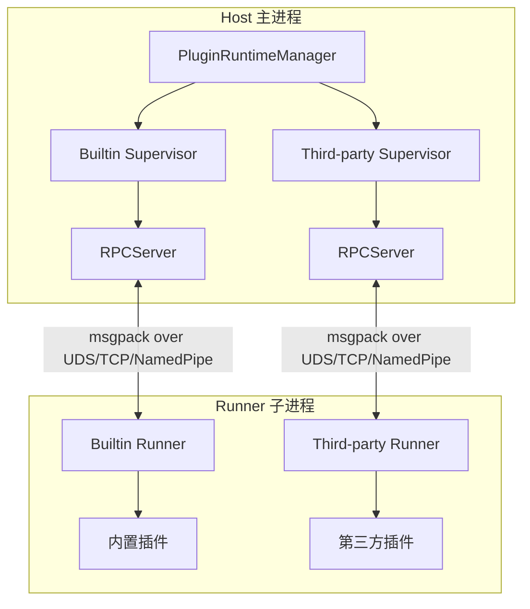
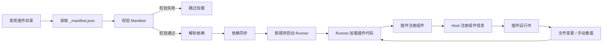

# 插件开发指南

MaiBot 的插件系统采用 Host/Runner IPC 架构，插件代码运行在独立的子进程中，通过消息协议与主进程通信。本节介绍插件系统的架构原理、开发流程和核心概念。

## 架构概览



### Host（主进程侧）

- **PluginRuntimeManager**：单例管理器，管理两个 `PluginSupervisor`
- **PluginSupervisor**：负责 Runner 子进程的启动、停止、健康检查和插件重载
- **ComponentRegistry**：组件注册表，管理 Action、Command、Tool 组件的注册信息
- **HookDispatcher**：Hook 分发器，将 Hook 调用分发到对应的 Supervisor

### Runner（子进程侧）

- 插件代码在独立进程中加载和运行
- 通过 `PluginLoader` 发现和加载插件
- 通过 `RPCClient` 与 Host 通信
- 每个插件可以在 `plugin.py` 中通过 `create_plugin()` 注册组件

### 通信协议

- **编解码**：使用 msgpack 格式进行二进制序列化（`MsgPackCodec`）
- **传输层**：支持 Unix Domain Socket、TCP、Named Pipe 三种传输方式
- **RPC 模型**：Host 通过 `invoke_plugin()` 调用 Runner 中的组件，Runner 通过能力 API 回调 Host 服务

## 插件生命周期



1. **发现**：`ManifestValidator` 扫描插件目录，读取 `_manifest.json`
2. **校验**：验证 Manifest 的结构、版本兼容性、依赖声明
3. **依赖解析**：`PluginDependencyPipeline` 同步 Python 包依赖，处理跨 Supervisor 依赖
4. **加载**：Runner 子进程加载插件代码并注册组件
5. **监控**：Supervisor 持续监控 Runner 健康状态，文件变更时触发热重载

## 快速开始

### 1. 创建插件目录

```
plugins/
└── my-plugin/
    ├── _manifest.json
    ├── plugin.py
    └── config.toml          # 可选
```

### 2. 编写 Manifest

在 `_manifest.json` 中声明插件元信息（详见 [Manifest 系统](./manifest.md)）：

```json
{
  "manifest_version": 2,
  "id": "com.example.my-plugin",
  "version": "1.0.0",
  "name": "我的插件",
  "description": "一个示例插件",
  "author": {
    "name": "开发者",
    "url": "https://github.com/developer"
  },
  "license": "MIT",
  "urls": {
    "repository": "https://github.com/developer/my-plugin"
  },
  "host_application": {
    "min_version": "1.0.0",
    "max_version": "1.0.0"
  },
  "sdk": {
    "min_version": "1.0.0",
    "max_version": "1.0.0"
  },
  "capabilities": ["send_message", "receive_message"],
  "i18n": {
    "default_locale": "zh-CN"
  }
}
```

### 3. 编写插件代码

在 `plugin.py` 中使用 `create_plugin()` 注册插件：

```python
from maibot_plugin_sdk import create_plugin

plugin = create_plugin()

@plugin.on_start
async def on_start():
    plugin.logger.info("插件已启动")

@plugin.command(pattern=r"^/hello(?P<name>.+)?$")
async def hello_command(text, matched_groups, **kwargs):
    name = matched_groups.get("name", "世界").strip()
    return True, f"你好，{name}！", False
```

### 4. 安装与运行

将插件目录放入 `plugins/` 文件夹，启动 MaiBot 后插件会自动被发现和加载。也可以通过 WebUI 进行插件管理。

## 目录结构约定

```
my-plugin/
├── _manifest.json       # 必需：插件清单
├── plugin.py            # 必需：插件入口
├── config.toml          # 可选：插件配置
├── i18n/                # 可选：国际化资源
│   ├── zh-CN.json
│   └── en-US.json
└── assets/              # 可选：静态资源
```

## 内置插件与第三方插件

MaiBot 维护两个独立的 Runner 子进程：

- **内置插件**：位于 `src/plugins/built_in/`，运行在 builtin Supervisor 下
- **第三方插件**：位于 `plugins/`，运行在 third-party Supervisor 下

两者使用相同的通信协议和组件注册机制。Supervisor 之间的启动顺序由跨 Supervisor 依赖关系决定，如果检测到循环依赖则拒绝启动。

## 下一步

- [Manifest 系统](./manifest.md)：了解 `_manifest.json` 的完整字段定义
- [Hook 系统](./hooks.md)：学习如何使用 Hook 拦截和改写消息
- [Action 组件](./actions.md)：学习如何开发 Action 组件
- [Command 组件](./commands.md)：学习如何开发 Command 组件
- [Tool 组件](./tools.md)：学习如何开发 Tool 组件
- [配置管理](./config.md)：学习如何管理插件配置
- [API 参考](./api-reference.md)：查阅完整的插件 SDK API
