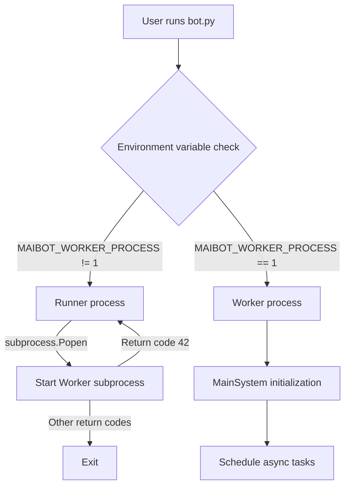
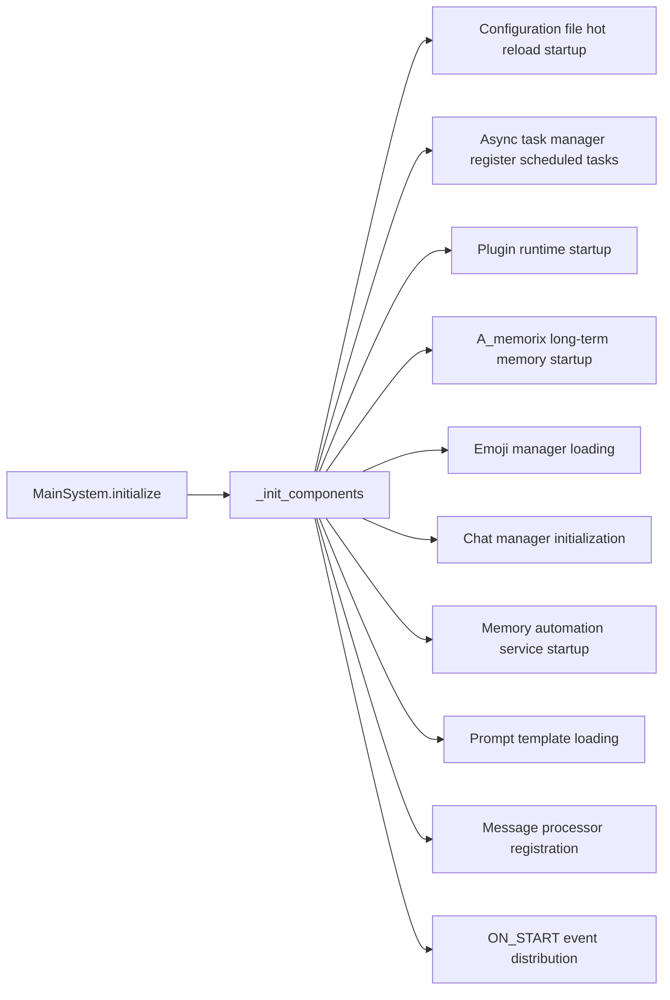
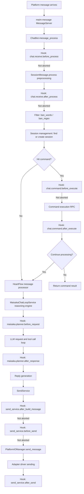
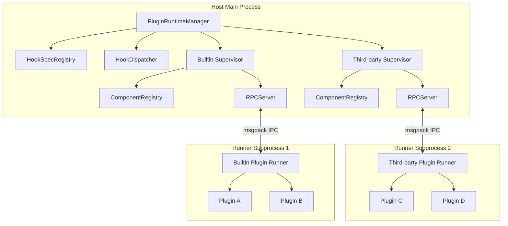
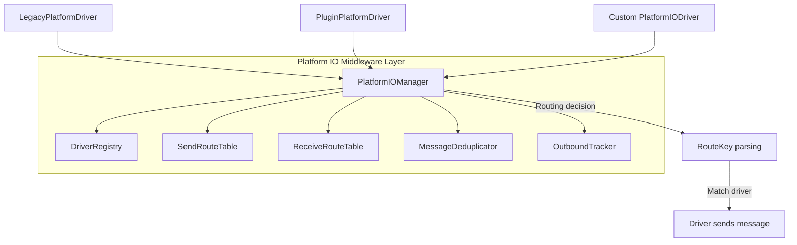

# Architecture Design

This article introduces MaiBot's core architecture, including process model, system initialization flow, message processing pipeline, and key components.

## Runner/Worker Process Model

MaiBot implements a Runner/Worker dual-process model through `bot.py`:

- **Runner process**: Daemon process responsible for starting and monitoring Worker subprocess. When Worker exits with exit code 42, Runner automatically restarts Worker (hot restart mechanism). When Runner receives Ctrl+C signal, it gracefully terminates Worker.
- **Worker process**: Process that actually executes business logic. After setting environment variable `MAIBOT_WORKER_PROCESS=1`, it enters Worker mode and executes `MainSystem` initialization and task scheduling.

## MainSystem Initialization Flow

`MainSystem.initialize()` initializes each component in parallel through `asyncio.gather`:

Core initialization sequence:

1. Start configuration file hot reload monitor
2. Register scheduled tasks (online time statistics, statistics output, telemetry heartbeat, expression method automatic check)
3. Start plugin runtime (`PluginRuntimeManager.start()`), establish twin processes (built-in plugins + third-party plugins)
4. Start A_memorix long-term memory service
5. Load emoji manager
6. Initialize chat manager
7. Register `ChatBot.message_process` to message API server
8. Load Prompt templates
9. Trigger `ON_START` event and distribute to plugin runtime

`schedule_tasks()` then starts continuously running services: emoji regular maintenance, message API server, message server, WebUI server.

## Message Processing Pipeline

MaiBot's message processing is a complete pipeline from inbound reception to outbound sending:

### Pipeline Stages in Detail

#### 1. Message Inbound

Messages arrive through maim-message `MessageServer`, and the registered `ChatBot.message_process` processing function is called.

#### 2. Hook Interception Chain

- **chat.receive.before_process**: Triggered before `SessionMessage.process()`, can intercept or rewrite original messages.
- **chat.receive.after_process**: Triggered after message preprocessing is complete, can rewrite text, message body, or abort subsequent pipeline.

#### 3. Message Filtering

Filter inappropriate content through `ban_words` (blocked words) and `ban_regex` (blocked regex) in the configuration.

#### 4. Session Management

`ChatManager` finds or creates corresponding sessions, maintaining session context and state.

#### 5. Command Processing

`ComponentQueryService.find_command_by_text()` finds matching commands in the plugin component registry. After command matching, sequentially trigger `chat.command.before_execute` and `chat.command.after_execute` Hooks, then call the command executor in the Runner subprocess through RPC.

#### 6. HeartFlow Processing

Messages not intercepted by commands enter `HeartFCMessageReceiver`, scheduled to the Maisaka reasoning engine by the HeartFlow message processor.

#### 7. Maisaka Reasoning Engine

`ChatLoopService` builds context message windows, candidate tool lists, and makes requests to LLM:
- **maisaka.planner.before_request**: Can rewrite message windows and tool definitions
- LLM request and tool call loop
- **maisaka.planner.after_response**: Can adjust text results and tool call lists

#### 8. Outbound Sending

`SendService` builds outbound messages, and after multi-level Hooks, routes to specific platform drivers through `PlatformIOManager`:
- **send_service.after_build_message**: Can rewrite message body or cancel sending
- **send_service.before_send**: Final interception point before sending
- Platform IO routing decision and driver sending
- **send_service.after_send**: Observe final sending results

## Plugin Runtime Architecture

- **PluginRuntimeManager**: Singleton manager managing two `PluginSupervisor` (built-in plugins + third-party plugins).
- **PluginSupervisor**: Each Supervisor manages one Runner subprocess, responsible for lifecycle, RPC communication, health checks, and plugin reloading.
- **Runner subprocess**: Independent process loads and runs plugin code, communicates with Host through msgpack-encoded IPC.
- **ComponentRegistry**: Component registry managing registration information for Action, Command, Tool three types of components.

## Platform IO Architecture

- **PlatformIOManager**: Broker manager maintaining send/receive route tables, driver registry, inbound deduplication, and outbound tracking.
- **RouteKey**: Routing key composed of `platform` (platform), `account_id` (account), `scope` (scope), supporting fallback matching from most specific to most general.
- **PlatformIODriver**: Driver abstract base class defining interfaces such as `send_message()`, `start()`, `stop()`, `emit_inbound()`.
