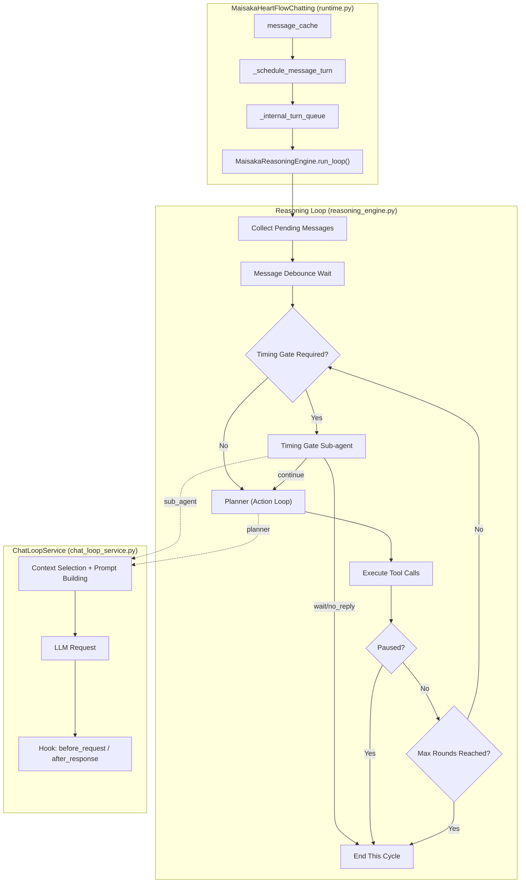
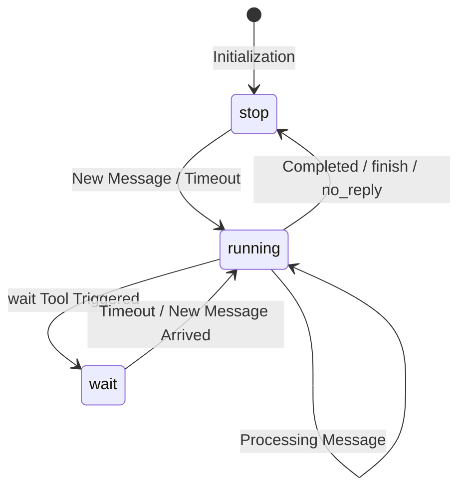
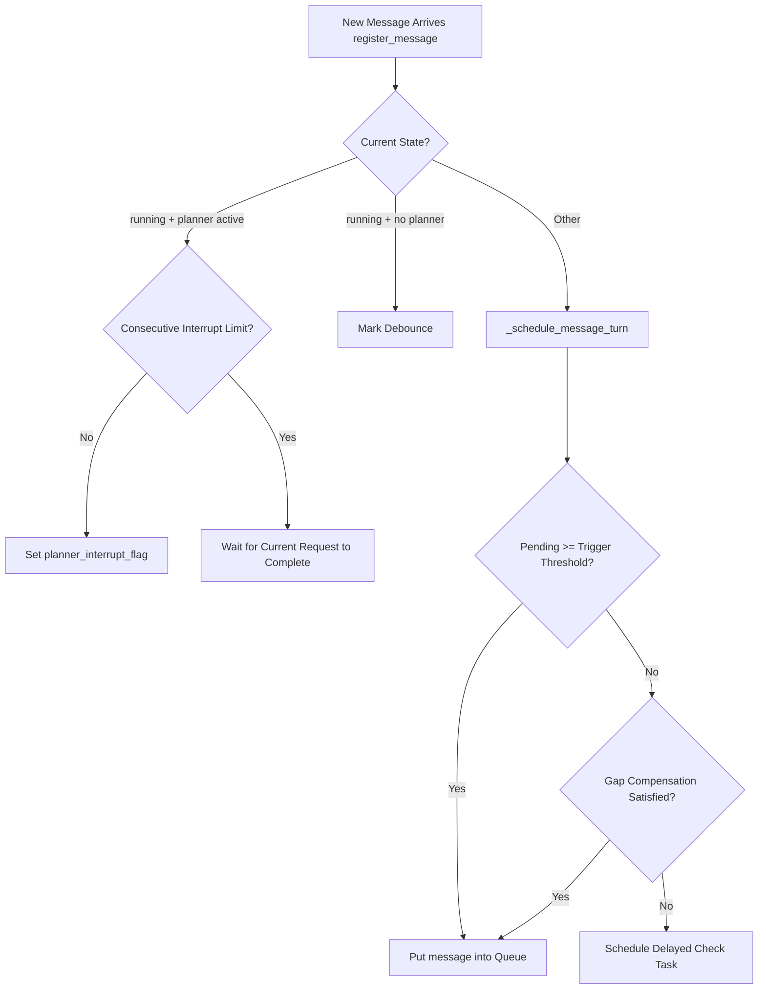
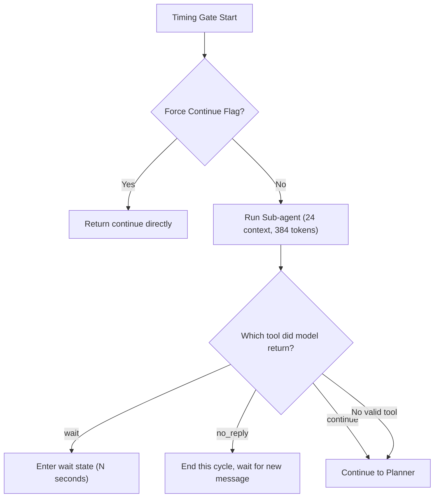
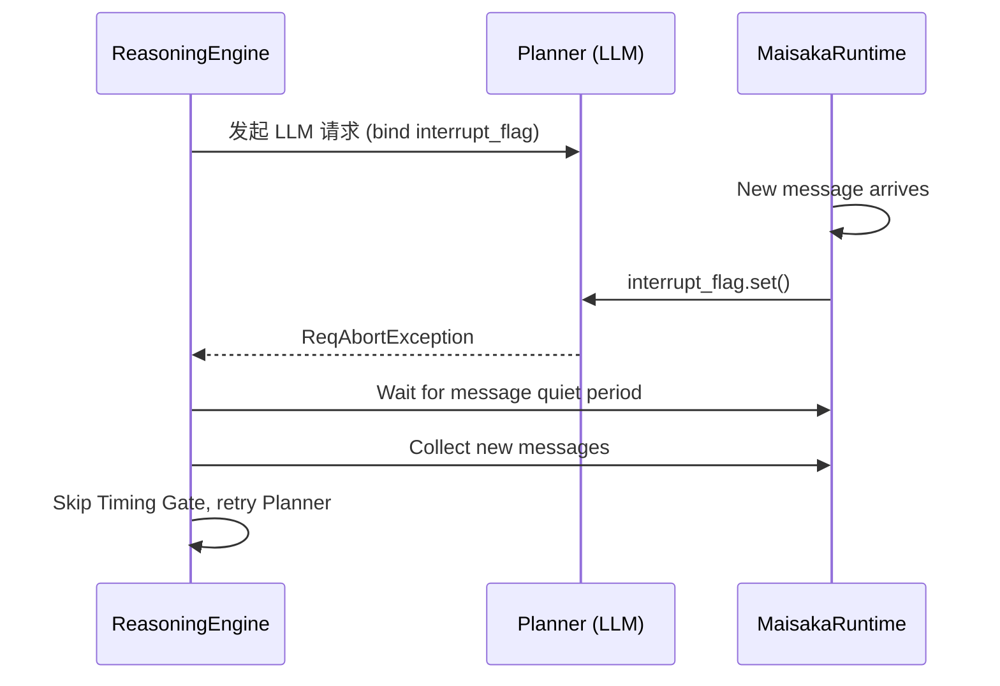
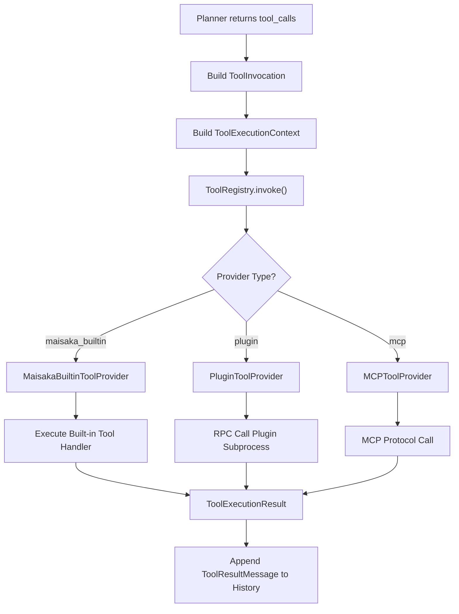
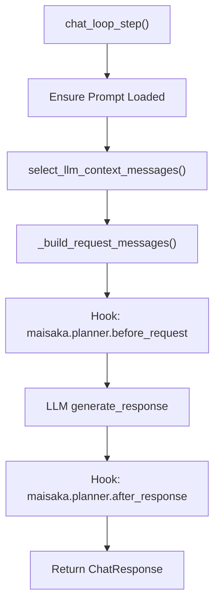
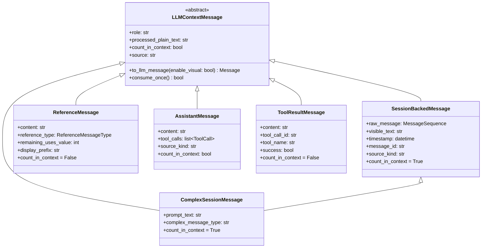
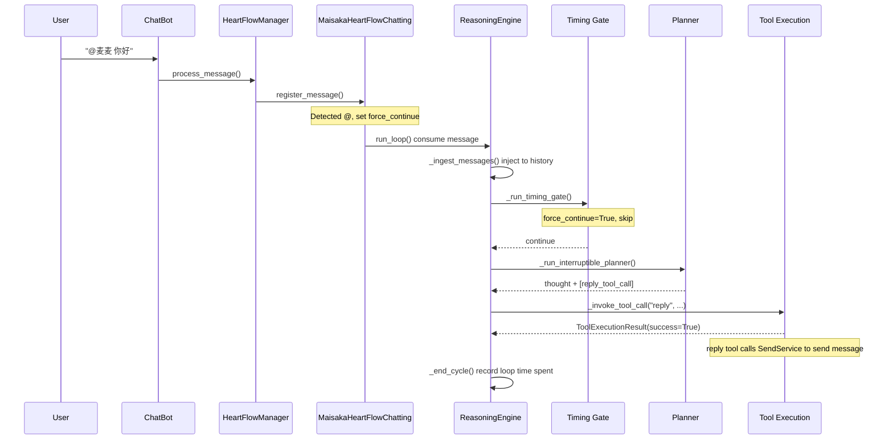

# Maisaka Reasoning Engine

Maisaka is MaiBot's core AI runtime, responsible for dialogue reasoning, pacing control, and tool invocation. This document details its internal architecture, state machine, and execution flow.

## Architecture Overview



## MaisakaHeartFlowChatting

Source location: `src/maisaka/runtime.py`

Each chat session corresponds to a `MaisakaHeartFlowChatting` instance, managed by `HeartflowManager`.

### State Machine

The runtime has three states:



| State | Description |
|-------|-------------|
| `running` | Executing reasoning loop |
| `wait` | Waiting state, wait tool set a timeout |
| `stop` | Idle state, waiting for new external message trigger |

### Core Properties

| Property | Type | Description |
|----------|------|-------------|
| `session_id` | `str` | Session ID |
| `_chat_history` | `list[LLMContextMessage]` | Internal context history |
| `message_cache` | `list[SessionMessage]` | Pending message cache |
| `_internal_turn_queue` | `asyncio.Queue` | Internal loop trigger queue ("message" / "timeout") |
| `_tool_registry` | `ToolRegistry` | Unified tool registry |
| `_reasoning_engine` | `MaisakaReasoningEngine` | Reasoning engine |
| `_chat_loop_service` | `MaisakaChatLoopService` | Chat loop service |
| `_max_internal_rounds` | `int` | Max internal rounds (default 6) |
| `_max_context_size` | `int` | Max context message count |
| `_message_debounce_seconds` | `float` | Message debounce seconds (default 1.0) |
| `_talk_frequency_adjust` | `float` | Talk frequency multiplier |
| `deferred_tool_specs_by_name` | `dict[str, ToolSpec]` | Deferred discovery tool pool |
| `discovered_tool_names` | `set[str]` | Discovered deferred tools |

### Message Trigger Mechanism



Trigger threshold calculation:
```python
effective_frequency = talk_value * _talk_frequency_adjust  # Reply frequency
trigger_threshold = ceil(1.0 / effective_frequency)  # Required message count
```

Gap Compensation: When new messages are insufficient but the gap time is long, calculate equivalent message count based on recent average reply time.

### Force Continue Mechanism

When @ or mention is detected, `_arm_force_next_timing_continue()` sets a flag so that the next Timing Gate directly returns `continue`, ensuring the bot responds to direct mentions.

## MaisakaReasoningEngine

Source location: `src/maisaka/reasoning_engine.py`

Core reasoning engine, responsible for internal thinking loops and tool execution.

### Key Constants

| Constant | Value | Description |
|----------|-------|-------------|
| `TIMING_GATE_CONTEXT_LIMIT` | 24 | Timing Gate context message limit |
| `TIMING_GATE_MAX_TOKENS` | 384 | Timing Gate max output tokens |
| `TIMING_GATE_TOOL_NAMES` | `{"continue", "no_reply", "wait"}` | Timing Gate available tools |
| `ACTION_HIDDEN_TOOL_NAMES` | `{"continue", "no_reply"}` | Action Loop hidden tools |
| `MAX_INTERNAL_ROUNDS` | 6 | Max internal thinking rounds |

### run_loop Main Loop

```python
async def run_loop(self) -> None:
    while runtime._running:
        # 1. Wait for trigger signal
        queued_trigger = await runtime._internal_turn_queue.get()
        message_triggered, timeout_triggered = _drain_ready_turn_triggers(queued_trigger)

        # 2. Message debounce
        if message_triggered:
            await runtime._wait_for_message_quiet_period()

        # 3. Collect pending messages
        cached_messages = runtime._collect_pending_messages()

        # 4. Inject messages to history
        await _ingest_messages(cached_messages)

        # 5. Internal thinking loop
        for round_index in range(max_internal_rounds):
            # 5a. Timing Gate (if needed)
            if timing_gate_required:
                timing_action = await _run_timing_gate(anchor_message)
                if timing_action != "continue":
                    break  # wait or no_reply, end this cycle

            # 5b. Planner (Action Loop)
            response = await _run_interruptible_planner()

            # 5c. Similarity detection
            if _should_replace_reasoning(response.content):
                # Replace with rethinking prompt
                response.content = "I should reflect on my thinking above..."

            # 5d. Tool execution
            if response.tool_calls:
                should_pause, summaries, monitors = await _handle_tool_calls(...)
                if should_pause:
                    break
                continue  # New info after tool execution, continue loop

            break  # No tool call and no content, end
```

### Timing Gate

Timing Gate is an independent sub-agent that decides dialogue pacing:



Timing Gate system prompt:
- Primarily loads from `maisaka_timing_gate` template
- Fallback prompt emphasizes **call only one tool**, do not output plain text
- Available tools are only `wait`, `no_reply`, `continue`

### Planner (Action Loop)

Planner is the main reasoning and tool execution phase:

1. **Build Tool Definitions**: `_build_action_tool_definitions()`
   - Filter `ACTION_HIDDEN_TOOL_NAMES` (continue, no_reply)
   - Built-in Action tools directly exposed
   - Third-party/plugin tools placed in deferred pool, discovered via `tool_search`

2. **Run Interruptible Planner**: `_run_interruptible_planner()`
   - Bind `asyncio.Event` interrupt flag
   - When new message arrives → set flag → LLM request aborts (`ReqAbortException`)
   - Consecutive interrupts have a limit (`planner_interrupt_max_consecutive_count`)

3. **Thought Deduplication**: `_should_replace_reasoning()`
   - When current and previous thoughts have similarity > 90%
   - Replace with "rethink" prompt to avoid circular idle

### Planner Interrupt Mechanism



Post-interrupt behavior:
- If `has_pending_messages` and max rounds not reached → Skip Timing Gate, re-enter Planner
- Otherwise → End current loop

### Tool Execution

Tool calls are routed through unified `ToolRegistry`:



## Built-in Tool Definitions

Source location: `src/maisaka/builtin_tool/`

### Timing Gate Tools

| Tool Name | Source File | Description | Key Parameters |
|-----------|-------------|-------------|----------------|
| `continue` | `continue_tool.py` | Allow continuing to next thinking round | None |
| `no_reply` | `no_reply.py` | Stop current loop, wait for new external message | None |
| `wait` | `wait.py` | Pause dialogue for N seconds then re-judge | `seconds` (default 30) |

### Action Tools

| Tool Name | Source File | Description | Key Parameters |
|-----------|-------------|-------------|----------------|
| `reply` | `reply.py` | Generate and send reply message | `reply_text`, `msg_id`, `set_quote` |
| `send_emoji` | `send_emoji.py` | Send emoji | `emoji_description`, `msg_id` |
| `finish` | `finish.py` | End current thinking round | None |
| `query_jargon` | `query_jargon.py` | Query jargon/terms | `words` |
| `query_memory` | `query_memory.py` | Query long-term memory | `query`, `mode`, `limit` |
| `query_person_info` | `query_person_info.py` | Query person information | `person_name` |
| `view_complex_message` | `view_complex_message.py` | View complete forwarded message | `message_id` |
| `tool_search` | `tool_search.py` | Search deferred discovery tools | `query`, `limit` |

### Deferred Tool Discovery Mechanism

In Action Loop, third-party/plugin tools are not directly exposed to Planner, but discovered in two steps:

1. **tool_search**: Search deferred tool pool, mark matched tool names as "discovered"
2. **Next round Planner**: Discovered tools added to visible tool list

This reduces the number of tools Planner sees at once, avoiding choice paralysis.

## MaisakaChatLoopService

Source location: `src/maisaka/chat_loop_service.py`

Responsible for single-step LLM request encapsulation, including context selection, Prompt building, and Hook triggering.

### chat_loop_step Flow



### Context Selection Strategy

`select_llm_context_messages()` selects context for LLM from history:

1. Filter by `request_kind` (planner requests hide Timing Gate tool chain)
2. Traverse from end to front, select entries that can be successfully converted to LLM messages
3. Only count messages with `count_in_context=True` (`ToolResultMessage` and `ReferenceMessage` don't occupy window)
4. Stop after reaching `max_context_size`
5. Hide earliest 50% of assistant text messages (preserve tool call chains)

### Hook Specs

| Hook | Can Abort | Can Rewrite | Description |
|------|-----------|-------------|-------------|
| `maisaka.planner.before_request` | ✗ | ✓ | Can rewrite message list and tool definitions |
| `maisaka.planner.after_response` | ✗ | ✓ | Can adjust text result and tool call list |

## Context Message Types

Source location: `src/maisaka/context_messages.py`



### ReferenceMessageType

| Value | Description |
|-------|-------------|
| `custom` | Custom reference message |
| `jargon` | Jargon/term query result |
| `memory` | Long-term memory retrieval result |
| `tool_hint` | Tool hint information (e.g., deferred tools reminder) |

### Context Window Occupation

| Message Type | Occupies Window | Description |
|--------------|-----------------|-------------|
| `SessionBackedMessage` | ✓ | Real user message |
| `ComplexSessionMessage` | ✓ | Complex/forwarded message |
| `ReferenceMessage` | ✗ | Reference info (doesn't occupy window) |
| `AssistantMessage` (assistant) | ✓ | Internal thinking text |
| `AssistantMessage` (perception) | ✗ | Perception text (interrupt hints, etc.) |
| `ToolResultMessage` | ✗ | Tool execution result |

## Planner Message Prefix

Source location: `src/maisaka/planner_message_utils.py`

When each user message is injected into Planner, a structured prefix is added:

```
[Time]HH:MM:SS
[Username]nickname
[User Group Nickname]group_card
[msg_id]message_id
[Message Content]actual message text
```

`build_planner_prefix()` builds the prefix, `build_planner_user_prefix_from_session_message()` extracts parameters from `SessionMessage`.

## Monitor Events

Source location: `src/maisaka/monitor_events.py`

Broadcasts events to frontend monitoring panel via WebSocket:

| Event | Trigger Timing | Key Data |
|-------|----------------|----------|
| `session.start` | Runtime starts | session_id, session_name |
| `message.ingested` | Message injected to history | speaker_name, content, message_id |
| `cycle.start` | Thinking loop starts | cycle_id, round_index, max_rounds |
| `timing_gate.result` | Timing Gate decision completed | action, content, tool_calls, prompt_tokens |
| `planner.finalized` | Planner completed | Complete cycle data, token statistics, time spent |

## Complete Reasoning Flow Example

Example: User sends an @bot message in a group chat:

