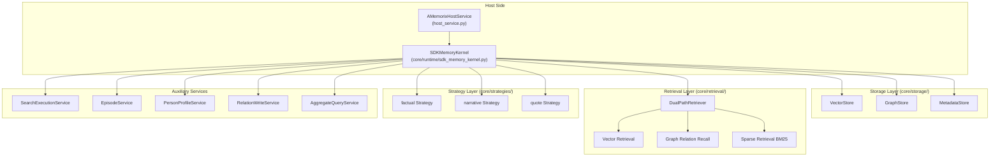
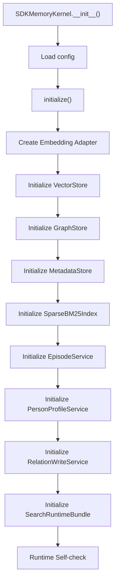
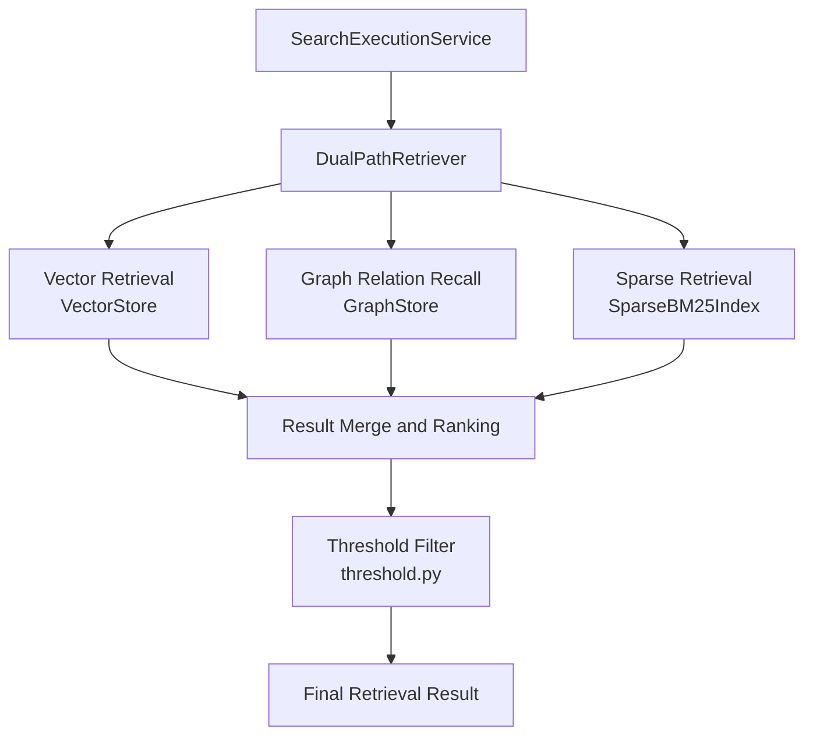

# Memory System (A-Memorix)

A-Memorix is MaiBot's built-in long-term memory subsystem, responsible for persisting user preferences, dialogue history, and person profiles. This document details its architecture, storage mechanisms, and retrieval flows.

## Architecture Overview



## SDKMemoryKernel

Source location: `src/A_memorix/core/runtime/sdk_memory_kernel.py`

`SDKMemoryKernel` is the core runtime of A-Memorix. On initialization, it loads configuration and builds all storage and retrieval components.

### Initialization Flow



### KernelSearchRequest

Data structure for retrieval requests:

| Field | Type | Default | Description |
|-------|------|---------|-------------|
| `query` | `str` | `""` | Query text |
| `limit` | `int` | `5` | Return count |
| `mode` | `str` | `"search"` | Retrieval mode |
| `chat_id` | `str` | `""` | Chat stream ID |
| `person_id` | `str` | `""` | Person ID |
| `time_start` | `Optional[str\|float]` | `None` | Start time |
| `time_end` | `Optional[str\|float]` | `None` | End time |
| `respect_filter` | `bool` | `True` | Whether to apply chat filter config |
| `user_id` | `str` | `""` | User ID |
| `group_id` | `str` | `""` | Group ID |

### Retrieval Modes

| Mode | Description | Required Parameters |
|------|-------------|---------------------|
| `search` | Semantic vector retrieval | `query` |
| `time` | Time range retrieval | `time_start` or `time_end` |
| `hybrid` | Vector + time hybrid | `time_start` or `time_end` |
| `episode` | Episode retrieval | `query` |
| `aggregate` | Aggregate retrieval | `query` |

::: warning
`semantic` mode has been removed; passing it will return a parameter error. `time` and `hybrid` modes **must** provide `time_start` or `time_end`, otherwise they return an error.
:::

## AMemorixHostService

Source location: `src/A_memorix/host_service.py`

Host-side service, bridging MaiBot main process with A-Memorix kernel:

```python
class AMemorixHostService:
    _kernel: Optional[SDKMemoryKernel]
    _config_cache: Dict[str, Any] | None

    async def start() -> None
    async def stop() -> None
    async def reload() -> None  # Close kernel → Re-read config → Rebuild kernel
    async def invoke(component_name, args) -> Any  # Unified invocation entry
```

### invoke Entry Point

`invoke()` routes to corresponding kernel methods based on component name:

| Component Name | Corresponding Kernel Method |
|----------------|----------------------------|
| `search_memory` | `kernel.search_memory()` |
| `ingest_summary` | `kernel.ingest_summary()` |
| `ingest_text` | `kernel.ingest_text()` |
| `get_person_profile` | `kernel.get_person_profile()` |
| `maintain_memory` | `kernel.maintain_memory()` |
| `memory_stats` | `kernel.memory_stats()` |
| `memory_graph_admin` | `kernel.memory_graph_admin()` |
| `memory_source_admin` | `kernel.memory_source_admin()` |
| `memory_episode_admin` | `kernel.memory_episode_admin()` |
| `memory_profile_admin` | `kernel.memory_profile_admin()` |
| `memory_runtime_admin` | `kernel.memory_runtime_admin()` |
| `memory_import_admin` | `kernel.memory_import_admin()` |
| `memory_tuning_admin` | `kernel.memory_tuning_admin()` |
| `memory_v5_admin` | `kernel.memory_v5_admin()` |
| `memory_delete_admin` | `kernel.memory_delete_admin()` |

### Configuration Management

- Config file path: `config/a_memorix.toml`
- Schema file: `src/A_memorix/config_schema.json`
- `get_config()` / `update_config()` / `get_raw_config()` / `update_raw_config()` for config read/write
- After updating config, automatically `reload()`, rebuild kernel instance

## Storage Layer

Source location: `src/A_memorix/core/storage/`

### VectorStore

Source: `vector_store.py`

Vector storage, storing paragraph embedding vectors, supports:

- Write vectors (paragraph hash → vector mapping)
- Nearest neighbor search (cosine similarity)
- Quantization support (`QuantizationType`: `int8`)
- Non-blocking write queue (on embedding failure, enqueue for retry)

### GraphStore

Source: `graph_store.py`

Knowledge graph storage, managing entities and relationships:

- Create/delete/rename nodes
- Create/delete/update edges (including weights)
- Relationship vector index
- Graph access operations (reinforce / protect / restore / freeze)

### MetadataStore

Source: `metadata_store.py`

Metadata storage, managing sources, paragraphs, and operations records:

- Source management: list, delete, batch delete
- Paragraph metadata tracking
- Relationship maintenance operations (reinforce / protect / restore / freeze / recycle_bin)
- V5 operations records (`external_memory_refs`, `memory_v5_operations`, `delete_operations`)

### knowledge_types.py

Defines data types for knowledge content, distinguishing factual knowledge from narrative knowledge.

## Retrieval Layer

Source location: `src/A_memorix/core/retrieval/`

### Dual-Path Retrieval Architecture



### Key Components

| File | Component | Description |
|------|-----------|-------------|
| `dual_path.py` | `DualPathRetriever` | Coordinates vector + graph joint recall |
| `graph_relation_recall.py` | Graph relation recall | Graph-based association lookup |
| `sparse_bm25.py` | `SparseBM25Index` | BM25-based sparse retrieval (requires FTS5 support) |
| `pagerank.py` | PageRank | Graph structure weight calculation |
| `threshold.py` | Threshold filter | Similarity threshold control |

### RetrievalResult

Data structure for retrieval results, containing matching paragraphs, similarity scores, and source information.

## Strategy Layer

Source location: `src/A_memorix/core/strategies/`

Write strategies determine how memories are processed and stored:

| Strategy | Source File | Description |
|----------|-------------|-------------|
| `factual` | `factual.py` | Factual knowledge strategy, extracts entities and relationships |
| `narrative` | `narrative.py` | Narrative strategy, handles dialogue summaries |
| `quote` | `quote.py` | Quote strategy, preserves original text |

All strategies inherit from base class in `base.py`, defining unified processing interface.

## Auxiliary Services

### EpisodeService

Source: `core/utils/episode_service.py`

Manages Episodes (dialogue segments), rebuild by source:

- State query (pending / processing / completed)
- Batch process pending Episodes
- Episode segmentation service (`EpisodeSegmentationService`)
- Episode retrieval service (`EpisodeRetrievalService`)

### PersonProfileService

Source: `core/utils/person_profile_service.py`

Person profile management:

- Auto snapshot: automatically extract person features from memory data
- Manual override: manually set profile attributes via API
- Profile query: get profile by person_id and chat_id

### RelationWriteService

Source: `core/utils/relation_write_service.py`

Relation write service:

- Joint write of entities and relationships
- `external_id` idempotent deduplication
- Joint paragraph/relationship write

### AggregateQueryService

Source: `core/utils/aggregate_query_service.py`

Aggregate query service, combines results from multiple retrieval modes.

### ImportTaskManager

Source: `core/utils/web_import_manager.py`

Web import task manager:

- Task creation (upload, paste, raw scan, LPMM modes)
- Task status tracking
- Chunk processing
- Failure retry

## Basic Tool Interfaces

### search_memory

Retrieve long-term memory.

**Parameters**:

| Parameter | Type | Required | Description |
|-----------|------|----------|-------------|
| `query` | `str` | No | Query text |
| `mode` | `str` | No | Retrieval mode (search/time/hybrid/episode/aggregate) |
| `limit` | `int` | No | Return count (default 5) |
| `chat_id` | `str` | No | Chat stream ID |
| `person_id` | `str` | No | Person ID |
| `time_start` | `float` | No | Start timestamp |
| `time_end` | `float` | No | End timestamp |
| `respect_filter` | `bool` | No | Whether to apply chat filter config |

### ingest_summary

Write chat summary to long-term memory.

**Parameters**:

| Parameter | Type | Required | Description |
|-----------|------|----------|-------------|
| `external_id` | `str` | Yes | External idempotent ID |
| `chat_id` | `str` | Yes | Chat stream ID |
| `text` | `str` | Yes | Summary text |
| `participants` | `list[str]` | No | Participant list |
| `time_start` | `float` | No | Start timestamp |
| `time_end` | `float` | No | End timestamp |
| `tags` | `list[str]` | No | Tags |
| `metadata` | `dict` | No | Metadata |

### ingest_text

Write normal text memory.

| Parameter | Type | Required | Description |
|-----------|------|----------|-------------|
| `external_id` | `str` | Yes | External idempotent ID |
| `source_type` | `str` | Yes | Source type |
| `text` | `str` | Yes | Original text |
| `chat_id` | `str` | No | Chat stream ID |
| `entities` | `list` | No | Entity list |
| `relations` | `list` | No | Relationship list |

### get_person_profile

Get person profile.

| Parameter | Type | Required | Description |
|-----------|------|----------|-------------|
| `person_id` | `str` | Yes | Person ID |
| `chat_id` | `str` | No | Chat stream ID |
| `limit` | `int` | No | Evidence count |

### maintain_memory

Maintain long-term memory relationship state.

| action | Description |
|--------|-------------|
| `reinforce` | Reinforce relationship |
| `protect` | Protect relationship (no decay within specified hours) |
| `restore` | Restore relationship |
| `freeze` | Freeze relationship |
| `recycle_bin` | View recycle bin |

## Admin Tool Interfaces

| Tool | Common Actions |
|------|----------------|
| `memory_graph_admin` | `get_graph` / `create_node` / `delete_node` / `rename_node` / `create_edge` / `delete_edge` / `update_edge_weight` |
| `memory_source_admin` | `list` / `delete` / `batch_delete` |
| `memory_episode_admin` | `query` / `list` / `get` / `status` / `rebuild` / `process_pending` |
| `memory_profile_admin` | `query` / `list` / `set_override` / `delete_override` |
| `memory_runtime_admin` | `save` / `get_config` / `self_check` / `refresh_self_check` / `set_auto_save` |
| `memory_import_admin` | `settings` / `get_guide` / `create_upload` / `create_paste` / `list` / `get` / `chunks` / `cancel` / `retry_failed` |
| `memory_tuning_admin` | `settings` / `get_profile` / `apply_profile` / `rollback_profile` / `create_task` / `list_tasks` / `get_task` / `cancel` / `apply_best` / `get_report` |
| `memory_v5_admin` | `status` / `recycle_bin` / `restore` / `reinforce` / `weaken` / `remember_forever` / `forget` |
| `memory_delete_admin` | `preview` / `execute` / `restore` / `get_operation` / `list_operations` / `purge` |

## Integration with MaiBot

### Plugin Mode (Legacy)

Source location: `src/A_memorix/plugin.py`

`AMemorixPlugin` inherits from `MaiBotPlugin`, registers memory retrieval and write tools to plugin runtime via `@Tool` decorator.

::: info
Current MaiBot mainline is directly integrated via `AMemorixHostService`, no longer discovered and loaded through plugin runtime. `plugin.py` is retained as a compatibility entry.
:::

### Configuration

- Default config file: `config/a_memorix.toml`
- Runtime data directory: `data/a-memorix` (controlled by `storage.data_dir`)
- Config Schema: `config_schema.json` for WebUI long-term memory console
- WebUI interface: `/api/webui/memory/*`

## Metadata Version

Current metadata schema version is **v9**, supporting:

- External references (`external_memory_refs`)
- Operations records (`memory_v5_operations`)
- Delete operations (`delete_operations`)

## Delete Semantics (source mode)

| Field | Description |
|-------|-------------|
| `requested_source_count` | Requested source count to delete |
| `matched_source_count` | Actually matched source count |
| `deleted_paragraph_count` | Actually deleted paragraph count |
| `deleted_count` | Same as actual deleted objects |
| `success` | Based on actual match and actual delete determination |