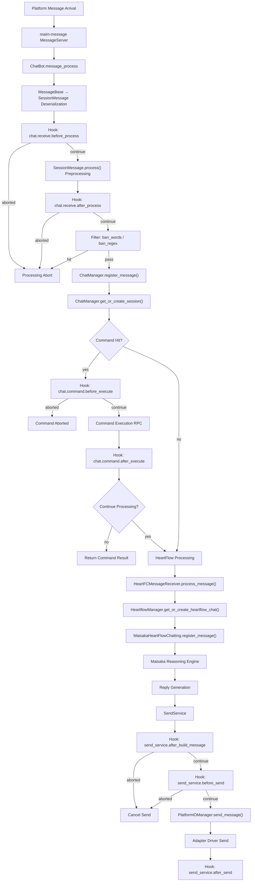

# Message Pipeline

MaiBot's message processing pipeline is the complete chain from inbound reception to outbound sending. This document details the internal mechanisms, data structures, and Hook interception points at each stage of the pipeline.

## Overall Flow



## Message Inbound and Deserialization

### Entry Point: `ChatBot.message_process()`

Source location: `src/chat/message_receive/bot.py`

Messages arrive through maim-message `MessageServer` and enter the main pipeline by calling `ChatBot.message_process(message_data)`:

```python
async def message_process(self, message_data: Dict[str, Any]) -> None:
    # 1. Ensure background tasks are started
    await self._ensure_started()
    # 2. Normalize group_id / user_id to strings
    # 3. Deserialize
    maim_raw_message = MessageBase.from_dict(message_data)
    message = SessionMessage.from_maim_message(maim_raw_message)
    await self.receive_message(message)
```

### `SessionMessage` Structure

Source location: `src/chat/message_receive/message.py`

`SessionMessage` inherits from `MaiMessage` and is the core message object flowing through the pipeline:

| Attribute | Type | Description |
|------|------|------|
| `message_id` | `str` | Unique message ID |
| `platform` | `str` | Source platform identifier |
| `session_id` | `str` | Session ID (calculated by `SessionUtils.calculate_session_id()`) |
| `processed_plain_text` | `str` | Preprocessed plain text |
| `message_info` | `MessageInfo` | Contains `user_info`, `group_info`, `additional_config` |
| `raw_message` | `MessageSequence` | Original message component sequence |
| `is_at` | `bool` | Whether bot was @ mentioned |
| `is_mentioned` | `bool` | Whether bot was mentioned |
| `is_command` | `bool` | Whether message hit a command |
| `is_notify` | `bool` | Whether it's a notification message |
| `timestamp` | `datetime` | Message timestamp |

### `SessionMessage.process()` Preprocessing

Converts raw message components to plain text, supporting the following component types:

| Component | Processing Method |
|------|----------|
| `TextComponent` | Direct text return |
| `ImageComponent` | Call `image_manager.get_image_description()` to generate `[Image: Description]` |
| `EmojiComponent` | Call `emoji_manager.get_emoji_description()` to generate `[Emoji: Description]` |
| `AtComponent` | Parse target username, generate `@nickname` |
| `VoiceComponent` | Call `get_voice_text()` to transcribe as `[Voice: Transcription]` |
| `ReplyComponent` | Find original message content, generate `[Reply to XXX's message: Content]` |
| `ForwardNodeComponent` | Recursively process forward nodes, generate `【Forwarded Message: ...】` |

The inbound main chain uses lightweight mode (`enable_heavy_media_analysis=False, enable_voice_transcription=False`), with image/emoji binary data filled in on-demand when Maisaka needs it.

## Hook Interception Chain

### chat.receive.before_process

Triggered before `SessionMessage.process()`, can intercept or rewrite the original message.

| Attribute | Value |
|------|-----|
| Registration Location | `src/chat/message_receive/bot.py` `register_chat_hook_specs()` |
| Default Timeout | 8000ms |
| Allows Abort | Yes |
| Allows Rewrite | Yes |

Parameter Schema:
```json
{
  "message": { "type": "object", "description": "Serialized SessionMessage of current inbound message" }
}
```

### chat.receive.after_process

Triggered after message preprocessing completes, can rewrite text, message body, or abort subsequent pipeline.

| Attribute | Value |
|------|-----|
| Default Timeout | 8000ms |
| Allows Abort | Yes |
| Allows Rewrite | Yes |

### chat.command.before_execute

Triggered after command matching succeeds, before actual execution.

| Attribute | Value |
|------|-----|
| Default Timeout | 5000ms |
| Allows Abort | Yes |
| Allows Rewrite | Yes |

Parameters include: `message`, `command_name`, `plugin_id`, `matched_groups`

### chat.command.after_execute

Triggered after command execution completes, can adjust return text and whether to continue main chain processing.

| Attribute | Value |
|------|-----|
| Default Timeout | 5000ms |
| Allows Abort | No |
| Allows Rewrite | Yes |

Parameters include: `message`, `command_name`, `plugin_id`, `matched_groups`, `success`, `response`, `intercept_message_level`, `continue_process`

### send_service.after_build_message

Triggered after outbound `SessionMessage` construction completes, can rewrite message body or cancel sending.

| Attribute | Value |
|------|-----|
| Registration Location | `src/services/send_service.py` `register_send_service_hook_specs()` |
| Default Timeout | 5000ms |
| Allows Abort | Yes |

### send_service.before_send

Triggered before actually calling Platform IO to send, final interception point.

| Attribute | Value |
|------|-----|
| Default Timeout | 5000ms |
| Allows Abort | Yes |

### send_service.after_send

Triggered after sending process completes, for observation only. Does not allow abort or rewrite.

## Message Filtering

Source location: `src/chat/message_receive/bot.py` `receive_message()`

Filtering executes after the `chat.receive.after_process` Hook:

1. **Ban Words Filter** (`MessageUtils.check_ban_words()`): Checks if `processed_plain_text` contains configured `ban_words`
2. **Regex Filter** (`MessageUtils.check_ban_regex()`): Checks if it matches configured `ban_regex` patterns

Messages that hit filtering rules are directly discarded and won't enter any subsequent stages.

## Session Management

Source location: `src/chat/message_receive/chat_manager.py`

### ChatManager

Singleton `chat_manager` manages all chat sessions.

```python
class ChatManager:
    sessions: Dict[str, BotChatSession]    # session_id → BotChatSession
    last_messages: Dict[str, SessionMessage]  # session_id → most recent message
```

### Session ID Calculation

Generated by `SessionUtils.calculate_session_id()` based on the following parameters:

- `platform`: Platform identifier
- `user_id`: User ID
- `group_id`: Group ID (optional)
- `account_id`: Platform account ID (optional, extracted from `additional_config`)
- `scope`: Routing scope (optional, extracted from `additional_config`)

### BotChatSession

Inherits from `MaiChatSession`, extended with:

| Attribute | Type | Description |
|------|------|------|
| `context` | `SessionContext` | Session context (including recent messages, template name) |
| `accept_format` | `List[str]` | List of acceptable message formats |

| Method | Description |
|------|------|
| `update_active_time()` | Update last active time |
| `set_context(message)` | Set session context |
| `check_types(types)` | Check if message matches acceptable types |

## Command Processing

Source location: `src/chat/message_receive/bot.py` `_process_commands()`

Command processing flow:

1. `component_query_service.find_command_by_text(text)` finds matching commands in the plugin component registry
2. After hit, trigger `chat.command.before_execute` Hook
3. Call command executor `command_executor()`, passing `message`, `plugin_config`, `matched_groups`
4. Trigger `chat.command.after_execute` Hook
5. Decide whether to continue subsequent processing based on `intercept_message_level`
   - `intercept_message_level == 0`: Continue processing (message will also go through HeartFlow)
   - `intercept_message_level > 0`: Stop processing

Messages intercepted by commands are written to database (`MessageUtils.store_message_to_db()`) but no longer enter HeartFlow.

## HeartFlow Processing

Source location: `src/chat/heart_flow/`

### HeartFCMessageReceiver

Source location: `src/chat/heart_flow/heartflow_message_processor.py`

```python
class HeartFCMessageReceiver:
    async def process_message(self, message: SessionMessage):
        # 1. Skip notification messages
        # 2. Store message to database
        # 3. Get or create HeartFlow Chat
        # 4. Register message to Maisaka runtime
        # 5. Register user to Person information library
```

### HeartflowManager

Source location: `src/chat/heart_flow/heartflow_manager.py`

Manages session-level `MaisakaHeartFlowChatting` instances:

```python
class HeartflowManager:
    heartflow_chat_list: Dict[str, MaisakaHeartFlowChatting]
    _chat_create_locks: Dict[str, asyncio.Lock]

    async def get_or_create_heartflow_chat(self, session_id: str) -> MaisakaHeartFlowChatting
    def adjust_talk_frequency(self, session_id: str, frequency: float) -> None
```

Uses double-checked locking to ensure only one Maisaka runtime instance is created per session.

## Outbound Sending

Source location: `src/services/send_service.py`

`SendService` builds outbound messages with the following flow:

1. Build `MessageSending` object (`SessionMessage` + target information)
2. Trigger `send_service.after_build_message` Hook
3. Calculate typing time (`calculate_typing_time()`)
4. Trigger `send_service.before_send` Hook
5. Route to platform driver via `PlatformIOManager.send_message()`
6. Trigger `send_service.after_send` Hook
7. Successfully sent messages are written to database and synchronized to Maisaka history

## Built-in Hook Summary

All built-in Hooks are registered uniformly by `hook_catalog.py`:

| Hook Name | Registration Module | Trigger Timing | Abortable |
|-----------|---------|---------|--------|
| `chat.receive.before_process` | `chat/message_receive/bot.py` | Before message preprocessing | ✓ |
| `chat.receive.after_process` | `chat/message_receive/bot.py` | After message preprocessing | ✓ |
| `chat.command.before_execute` | `chat/message_receive/bot.py` | Before command execution | ✓ |
| `chat.command.after_execute` | `chat/message_receive/bot.py` | After command execution | ✗ |
| `maisaka.planner.before_request` | `maisaka/chat_loop_service.py` | Before LLM request | ✗ |
| `maisaka.planner.after_response` | `maisaka/chat_loop_service.py` | After LLM response | ✗ |
| `send_service.after_build_message` | `services/send_service.py` | After outbound message build | ✓ |
| `send_service.before_send` | `services/send_service.py` | Before sending | ✓ |
| `send_service.after_send` | `services/send_service.py` | After sending | ✗ |

## Data Flow Diagram

```mermaid
graph LR
    subgraph Inbound
        A[Platform Adapter] -->|MessageBase| B[SessionMessage]
    end
    subgraph Preprocessing
        B --> C[Hook: before_process]
        C --> D[process preprocessing]
        D --> E[Hook: after_process]
        E --> F[Filter Check]
    end
    subgraph Distribution
        F --> G[Command Matching]
        G -->|hit| H[Command Execution]
        G -->|miss| I[HeartFlow]
        H -->|continue| I
    end
    subgraph Reasoning
        I --> J[Maisaka Runtime]
        J --> K[Timing Gate]
        K --> L[Planner]
        L --> M[Tool Execution]
    end
    subgraph Outbound
        M --> N[SendService]
        N --> O[Platform IO]
        O --> P[Adapter Driver Send]
    end
```

