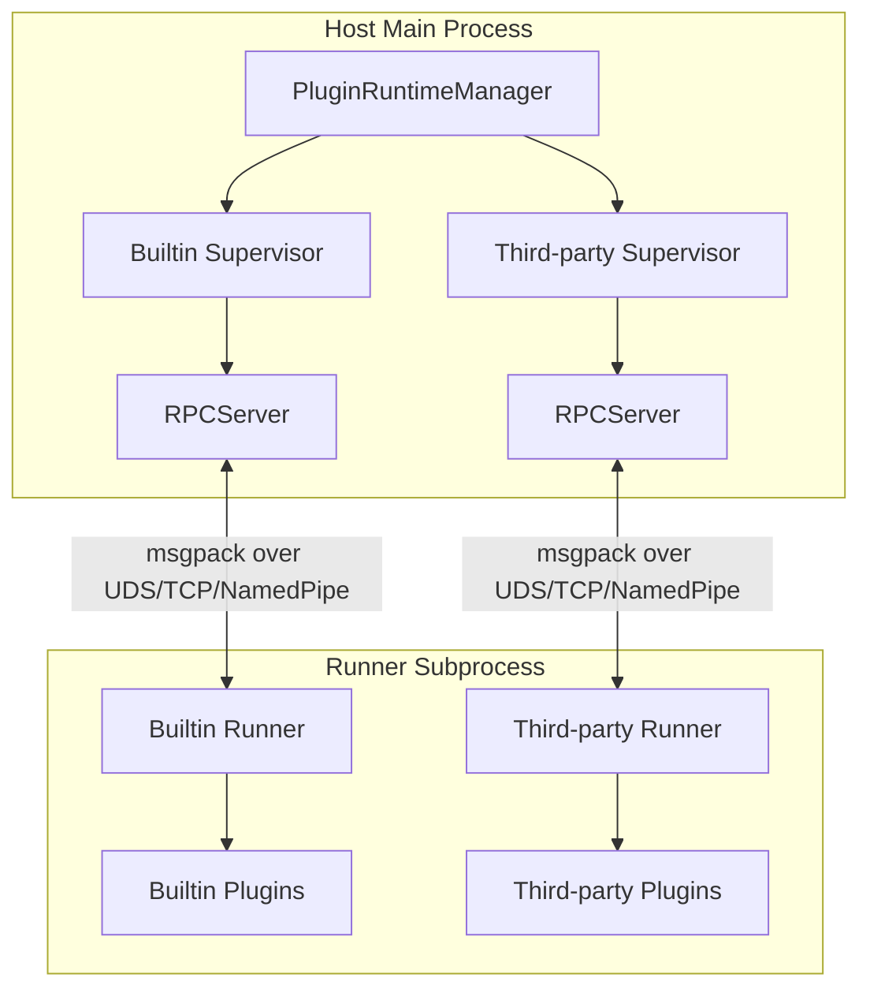
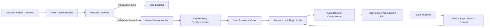

# Plugin Development Guide

MaiBot's plugin system uses Host/Runner IPC architecture, plugin code runs in independent subprocesses, communicates with main process through message protocol. This section introduces plugin system architecture principles, development process and core concepts.

## Architecture Overview



### Host (Main Process Side)

- **PluginRuntimeManager**: Singleton manager, manages two `PluginSupervisor`
- **PluginSupervisor**: Responsible for Runner subprocess startup, stop, health check and plugin reload
- **ComponentRegistry**: Component registry, manages Action, Command, Tool component registration information
- **HookDispatcher**: Hook dispatcher, distributes Hook calls to corresponding Supervisor

### Runner (Subprocess Side)

- Plugin code loads and runs in independent processes
- Discover and load plugins through `PluginLoader`
- Communicate with Host through `RPCClient`
- Each plugin can register components in `plugin.py` through `create_plugin()`

### Communication Protocol

- **Encoding/Decoding**: Use msgpack format for binary serialization (`MsgPackCodec`)
- **Transport Layer**: Support Unix Domain Socket, TCP, Named Pipe three transport methods
- **RPC Model**: Host calls components in Runner through `invoke_plugin()`, Runner calls back Host services through capability API

## Plugin Lifecycle



1. **Discovery**: `ManifestValidator` scans plugin directories, reads `_manifest.json`
2. **Validation**: Validate Manifest structure, version compatibility, dependency declarations
3. **Dependency Parsing**: `PluginDependencyPipeline` synchronizes Python package dependencies, handles cross-Supervisor dependencies
4. **Loading**: Runner subprocess loads plugin code and registers components
5. **Monitoring**: Supervisor continuously monitors Runner health status, triggers hot reload on file changes

## Quick Start

### 1. Create Plugin Directory

```
plugins/
└── my-plugin/
    ├── _manifest.json
    ├── plugin.py
    └── config.toml          # Optional
```

### 2. Write Manifest

Declare plugin meta information in `_manifest.json` (see [Manifest System](./manifest.md) for details):

```json
{
  "manifest_version": 2,
  "id": "com.example.my-plugin",
  "version": "1.0.0",
  "name": "My Plugin",
  "description": "An example plugin",
  "author": {
    "name": "Developer",
    "url": "https://github.com/developer"
  },
  "license": "MIT",
  "urls": {
    "repository": "https://github.com/developer/my-plugin"
  },
  "host_application": {
    "min_version": "1.0.0",
    "max_version": "1.0.0"
  },
  "sdk": {
    "min_version": "1.0.0",
    "max_version": "1.0.0"
  },
  "capabilities": ["send_message", "receive_message"],
  "i18n": {
    "default_locale": "zh-CN"
  }
}
```

### 3. Write Plugin Code

Use `create_plugin()` to register plugin in `plugin.py`:

```python
from maibot_plugin_sdk import create_plugin

plugin = create_plugin()

@plugin.on_start
async def on_start():
    plugin.logger.info("Plugin started")

@plugin.command(pattern=r"^/hello(?P<name>.+)?$")
async def hello_command(text, matched_groups, **kwargs):
    name = matched_groups.get("name", "world").strip()
    return True, f"Hello, {name}!", False
```

### 4. Install and Run

Put plugin directory into `plugins/` folder, plugin will be automatically discovered and loaded after starting MaiBot. Can also manage plugins through WebUI.

## Directory Structure Convention

```
my-plugin/
├── _manifest.json       # Required: Plugin manifest
├── plugin.py            # Required: Plugin entry
├── config.toml          # Optional: Plugin configuration
├── i18n/                # Optional: Internationalization resources
│   ├── zh-CN.json
│   └── en-US.json
└── assets/              # Optional: Static resources
```

## Built-in Plugins vs Third-party Plugins

MaiBot maintains two independent Runner subprocesses:

- **Built-in Plugins**: Located in `src/plugins/built_in/`, run under builtin Supervisor
- **Third-party Plugins**: Located in `plugins/`, run under third-party Supervisor

Both use the same communication protocol and component registration mechanism. Startup order between Supervisors is determined by cross-Supervisor dependency relationships, if circular dependencies are detected then startup is refused.

## Next Steps

- [Manifest System](./manifest.md): Understand complete field definitions of `_manifest.json`
- [Hook System](./hooks.md): Learn how to use Hook to intercept and rewrite messages
- [Action Components](./actions.md): Learn how to develop Action components
- [Command Components](./commands.md): Learn how to develop Command components
- [Tool Components](./tools.md): Learn how to develop Tool components
- [Configuration Management](./config.md): Learn how to manage plugin configurations
- [API Reference](./api-reference.md): Check complete plugin SDK API